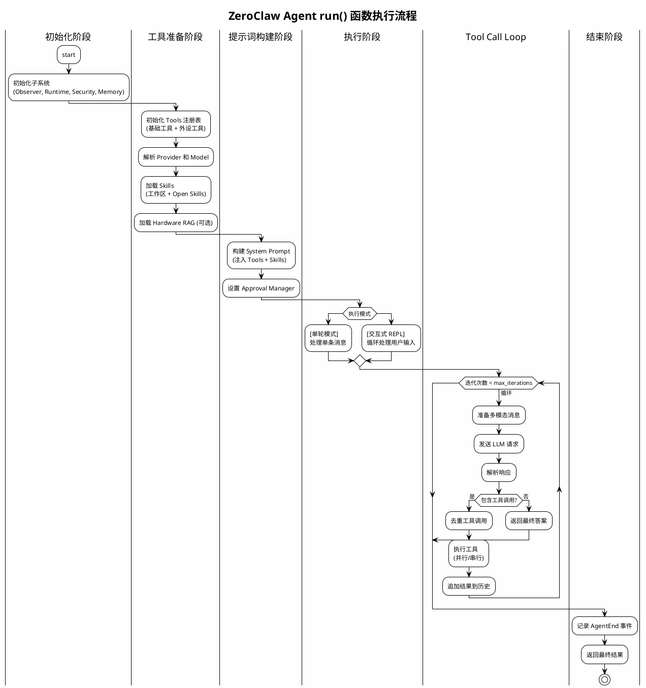

# Agent Loop Run 函数执行流程

本文档详细说明 `src/agent/loop_.rs` 中 `run` 函数的执行流程。

## 函数签名

```rust
pub async fn run(
    config: Config,
    message: Option<String>,
    provider_override: Option<String>,
    model_override: Option<String>,
    temperature: f64,
    peripheral_overrides: Vec<String>,
    interactive: bool,
) -> Result<String>
```

## 执行流程概览

`run` 函数是 ZeroClaw 代理的 CLI 入口点，负责协调所有子系统并进入单轮或交互式 REPL 模式。

### 流程图



### 流程概览表

| 阶段 | 步骤 | 说明 |
|-----|------|------|
| **初始化** | 1-4 | 初始化 Observer、Runtime、Security、Memory |
| **工具准备** | 5-6 | 注册所有工具，解析 Provider/Model |
| **RAG** | 7 | 加载硬件数据表（可选） |
| **提示词** | 8-9 | 构建 System Prompt，设置审批管理 |
| **执行** | 10 | 单轮模式或交互式 REPL |
| **结束** | 11 | 记录事件并返回 |

## 详细流程说明

### 1. 初始化子系统

```rust
// Observer: 可观测性系统，用于记录事件
let base_observer = observability::create_observer(&config.observability);
let observer: Arc<dyn Observer> = Arc::from(base_observer);

// Runtime: 运行时适配器
let runtime: Arc<dyn runtime::RuntimeAdapter> =
    Arc::from(runtime::create_runtime(&config.runtime)?);

// Security: 安全策略
let security = Arc::new(SecurityPolicy::from_config(
    &config.autonomy,
    &config.workspace_dir,
));
```

### 2. 初始化 Memory

根据配置创建记忆存储后端（如 SQLite），并记录初始化日志：

```rust
let mem: Arc<dyn Memory> = Arc::from(memory::create_memory_with_storage(
    &config.memory,
    Some(&config.storage.provider.config),
    &config.workspace_dir,
    config.api_key.as_deref(),
)?);
```

### 3. 初始化 Tools

合并所有工具到注册表：

1. **基础工具**: shell、file_read、file_write、memory_*
2. **Cron 工具**: cron_add、cron_list、cron_remove、cron_update、cron_run、cron_runs
3. **图像工具**: screenshot、image_info
4. **浏览器工具** (可选，需 `config.browser.enabled`)
5. **Composio 工具** (可选，需 `config.composio.enabled`)
6. **调度工具**: schedule
7. **模型路由工具**: model_routing_config
8. **外设工具** (可选，需 `config.peripherals.enabled`):
   - gpio_read/gpio_write
   - arduino_upload
   - hardware_memory_map
   - hardware_board_info
   - hardware_memory_read
   - hardware_capabilities

### 4. 解析 Provider 和 Model

```rust
// 解析 Provider 名称（CLI 覆盖 > 配置 > 默认值 "openrouter"）
let provider_name = provider_override
    .as_deref()
    .or(config.default_provider.as_deref())
    .unwrap_or("openrouter");

// 解析 Model 名称（CLI 覆盖 > 配置 > 默认值）
let model_name = model_override
    .as_deref()
    .or(config.default_model.as_deref())
    .unwrap_or("anthropic/claude-sonnet-4");
```

创建 Provider 实例时传入运行时选项：
- `auth_profile_override`: 认证配置文件覆盖
- `provider_api_url`: API URL
- `zeroclaw_dir`: 配置目录
- `secrets_encrypt`: 是否加密密钥
- `reasoning_enabled`: 是否启用推理

### 5. 加载 Hardware RAG (可选)

如果配置了 `peripherals.datasheet_dir`，加载硬件数据表用于 RAG：

```rust
let hardware_rag: Option<crate::rag::HardwareRag> = config
    .peripherals
    .datasheet_dir
    .as_ref()
    .filter(|d| !d.trim().is_empty())
    .map(|dir| crate::rag::HardwareRag::load(&config.workspace_dir, dir.trim()))
    .and_then(Result::ok)
    .filter(|r: &crate::rag::HardwareRag| !r.is_empty());
```

### 6. 构建 System Prompt

系统提示词通过 `build_system_prompt_with_mode` 构建，包含：

1. **基础身份设定**
2. **工具描述列表** (根据启用的功能动态生成)
3. **Skills** (从工作区加载)
4. **工具使用协议** (仅非原生工具模式)

工具描述包括使用时机和禁忌：
- `shell`: 执行终端命令
- `file_read`: 读取文件
- `file_write`: 写入文件
- `memory_store/memory_recall/memory_forget`: 记忆操作
- 其他可选工具...

#### Skills 处理

Skills 是用户定义或社区贡献的能力模块，存储在 `~/.zeroclaw/workspace/skills/<name>/` 目录下。

**加载来源**：

```rust
let skills = crate::skills::load_skills_with_config(&config.workspace_dir, &config);
```

1. **Open Skills 社区仓库**（可选）：自动克隆/同步 `besoeasy/open-skills`
2. **工作区 Skills**：`workspace/skills/` 目录下的自定义 Skill

**Skill 格式**：

- `SKILL.toml`：结构化定义（推荐）
  ```toml
  [skill]
  name = "my-skill"
  description = "What this skill does"
  version = "0.1.0"

  [[tools]]
  name = "my_tool"
  description = "Tool description"
  kind = "shell"
  command = "echo hello"
  ```

- `SKILL.md`：简单 Markdown 格式（指令直接写入文件）

**注入方式**：

Skills 通过 XML 格式注入到 System Prompt：

```xml
## Available Skills

<available_skills>
  <skill>
    <name>my-skill</name>
    <description>What this skill does</description>
    <location>skills/my-skill/SKILL.toml</location>
    <instructions>
      <instruction>具体指令内容...</instruction>
    </instructions>
    <tools>
      <tool>
        <name>my_tool</name>
        <description>Tool description</description>
        <kind>shell</kind>
      </tool>
    </tools>
  </skill>
</available_skills>
```

**注入模式**（由 `skills.prompt_injection_mode` 控制）：

| 模式 | 说明 |
|-----|------|
| `Full` | 完整注入，包含所有指令和工具定义 |
| `Compact` | 精简模式，仅注入摘要和路径，按需读取 |

在 `Compact` 模式下，代理只有在需要时才通过 `file_read` 读取 Skill 文件，减少上下文占用。

### 7. 设置 Approval Manager

在交互模式下启用审批管理：

```rust
let approval_manager = if interactive {
    Some(ApprovalManager::from_config(&config.autonomy))
} else {
    None
};
let channel_name = if interactive { "cli" } else { "daemon" };
```

### 8. 执行模式

#### 8.1 单轮模式 (`message` 提供)

```rust
if let Some(msg) = message {
    // 1. 自动保存用户消息到内存（如果满足长度条件）
    if config.memory.auto_save && msg.chars().count() >= AUTOSAVE_MIN_MESSAGE_CHARS {
        let user_key = autosave_memory_key("user_msg");
        let _ = mem.store(&user_key, &msg, MemoryCategory::Conversation, None).await;
    }

    // 2. 构建上下文 (Memory + Hardware RAG)
    let mem_context = build_context(mem.as_ref(), &msg, config.memory.min_relevance_score).await;
    let rag_limit = if config.agent.compact_context { 2 } else { 5 };
    let hw_context = hardware_rag
        .as_ref()
        .map(|r| build_hardware_context(r, &msg, &board_names, rag_limit))
        .unwrap_or_default();
    let context = format!("{mem_context}{hw_context}");

    // 3. 富集用户消息（添加上下文和时间戳）
    let now = chrono::Local::now().format("%Y-%m-%d %H:%M:%S %Z");
    let enriched = if context.is_empty() {
        format!("[{now}] {msg}")
    } else {
        format!("{context}[{now}] {msg}")
    };

    // 4. 构建对话历史
    let mut history = vec![
        ChatMessage::system(&system_prompt),
        ChatMessage::user(&enriched),
    ];

    // 5. 运行 Tool Call Loop
    let response = run_tool_call_loop(
        provider.as_ref(),
        &mut history,
        &tools_registry,
        observer.as_ref(),
        provider_name,
        model_name,
        temperature,
        false,  // silent
        approval_manager.as_ref(),
        channel_name,
        &config.multimodal,
        config.agent.max_tool_iterations,
        None,   // cancellation_token
        None,   // on_delta
        None,   // hooks
        &[],    // excluded_tools
    ).await?;

    // 6. 输出结果并记录事件
    println!("{response}");
    observer.record_event(&ObserverEvent::TurnComplete);
}
```

#### 8.2 交互式 REPL 模式

启动交互式命令行循环：

```rust
println!("🦀 ZeroClaw Interactive Mode");
println!("Type /help for commands.\n");

// 持久化对话历史
let mut history = vec![ChatMessage::system(&system_prompt)];

loop {
    print!("> ");
    // 读取用户输入...

    // 处理特殊命令
    match user_input.as_str() {
        "/quit" | "/exit" => break,
        "/help" => { /* 显示帮助 */ }
        "/clear" | "/new" => { /* 清除历史并确认 */ }
        _ => { /* 正常处理 */ }
    }

    // 与单轮模式相同的处理逻辑...

    // 历史管理
    auto_compact_history(&mut history, ...).await?;  // 自动压缩
    trim_history(&mut history, config.agent.max_history_messages);  // 硬截断
}
```

### 9. 结束记录

```rust
let duration = start.elapsed();
observer.record_event(&ObserverEvent::AgentEnd {
    provider: provider_name.to_string(),
    model: model_name.to_string(),
    duration,
    tokens_used: None,
    cost_usd: None,
});
```

## 关键辅助流程

### 上下文构建 (`build_context`)

1. 从 Memory 召回相关条目（基于用户查询的语义相似度）
2. 过滤低于相关性阈值的条目
3. 排除助手自动保存的条目（防止幻觉污染）

### Hardware RAG 上下文 (`build_hardware_context`)

#### 什么是 Hardware RAG？

Hardware RAG（Retrieval-Augmented Generation，检索增强生成）是 ZeroClaw 针对硬件外设开发场景设计的文档检索系统。它允许代理在回答硬件相关问题时，自动检索并注入相关数据表（datasheet）内容，从而提供准确的硬件信息。

**核心功能**：
- **文档解析**：支持 Markdown、纯文本，以及 PDF（需启用 `rag-pdf` 特性）
- **智能分块**：将长文档切分为语义连贯的片段
- **引脚别名映射**：将人类可读的名称（如 "red_led"）映射到具体引脚号
- **关键词检索**：基于查询关键词匹配相关文档片段
- **板级过滤**：根据当前连接的硬件板筛选相关内容

#### 文档格式

Hardware RAG 从配置的 `datasheet_dir` 目录加载文档，支持以下格式：

**1. 引脚别名定义（Markdown）**：

```markdown
## Pin Aliases
red_led: 13
green_led: 14
blue_led: 15
user_button: 0
```

或使用表格格式：

```markdown
## Pin Aliases
| alias       | pin |
|-------------|-----|
| red_led     | 13  |
| green_led   | 14  |
| blue_led    | 15  |
```

**2. 数据表内容**：

```markdown
# Nucleo-F401RE GPIO Reference

## GPIO Pins
The Nucleo-F401RE has multiple GPIO ports (PA, PB, PC).
Pin 13 on port PA is connected to the onboard green LED.

## ADC
ADC1 is available on pins PA0-PA7.
```

#### 工作流程

1. 从 `datasheet_dir` 加载所有文档
2. 解析引脚别名表，建立 `别名 → 引脚号` 映射
3. 将文档分块索引
4. 当用户查询时：
   - 检测查询中是否包含引脚别名，注入 `别名 = pin X` 信息
   - 检索与查询相关的文档块
   - 按板级相关性排序并限制数量

#### 实例说明

**场景**：用户询问 "How do I blink the red LED?"

**数据表文件** (`datasheets/nucleo-f401re.md`)：
```markdown
## Pin Aliases
red_led: 13

## GPIO Configuration
Pin 13 is the user LED (LD2) on Nucleo-F401RE.
To blink it, configure PA5 as output and toggle it.
```

**执行过程**：

```rust
// 1. 构建 Hardware RAG
let hardware_rag = HardwareRag::load(&workspace_dir, "datasheets")?;

// 2. 用户查询
let user_msg = "How do I blink the red LED?";
let boards = vec!["nucleo-f401re".to_string()];

// 3. 生成引脚别名上下文
let pin_ctx = hardware_rag.pin_alias_context(user_msg, &boards);
// 输出: "[Pin aliases for query]\nnucleo-f401re: red_led = pin 13\n"

// 4. 检索相关文档块
let chunks = hardware_rag.retrieve(user_msg, &boards, 5);
// 返回包含 "Pin 13 is the user LED..." 的文档块

// 5. 最终上下文注入到提示词
let context = format!("{}{}", pin_ctx, build_doc_context(&chunks));
// [Pin aliases for query]
// nucleo-f401re: red_led = pin 13
//
// [Hardware documentation]
// --- datasheets/nucleo-f401re.md (nucleo-f401re) ---
// Pin 13 is the user LED (LD2) on Nucleo-F401RE.
// To blink it, configure PA5 as output and toggle it.
```

**效果**：代理无需记忆具体的引脚号，能够准确地告诉用户使用 pin 13，并生成相应的 GPIO 控制代码。

#### 配置启用

在 `zeroclaw.toml` 中启用 Hardware RAG：

```toml
[peripherals]
enabled = true
datasheet_dir = "datasheets"  # 相对于工作区的目录

[[peripherals.boards]]
board = "nucleo-f401re"
```

将数据表文件放入工作区的 `datasheets/` 目录即可自动加载。

### Tool Call Loop

详见 `run_tool_call_loop` 函数，核心逻辑：

1. **迭代循环**: 最多 `max_tool_iterations` 轮（默认 10）
2. **LLM 请求**: 发送当前对话历史
3. **响应解析**: 解析工具调用（支持多种格式：OpenAI JSON、XML、GLM 等）
4. **工具执行**:
   - 去重相同签名工具调用
   - 支持并行执行（非审批场景）
   - 支持取消令牌
5. **结果处理**: 将结果追加到历史，继续下一轮
6. **终止条件**: LLM 返回纯文本答案或达到最大迭代次数

## 相关函数

| 函数 | 说明 |
|------|------|
| `agent_turn` | 单轮代理执行包装器 |
| `run_tool_call_loop` | 核心工具调用循环 |
| `process_message` | 供 Channel 使用的消息处理入口 |
| `build_tool_instructions` | 构建工具使用协议说明 |
| `auto_compact_history` | 自动压缩对话历史 |
| `trim_history` | 硬截断对话历史 |

## 安全与治理

1. **凭证擦除**: `scrub_credentials` 在日志和输出中自动擦除敏感信息
2. **审批管理**: 交互模式下可对敏感操作进行人工审批
3. **重复调用检测**: 防止同一轮次内重复执行相同工具调用
4. **最大迭代限制**: 防止代理无限循环

## 参见

- [`run_tool_call_loop`](./agent-loop-run-tool-call-loop.md) - 工具调用循环详细说明
- [Memory 系统](./memory-system.md)
- [Provider 架构](./provider-architecture.md)
