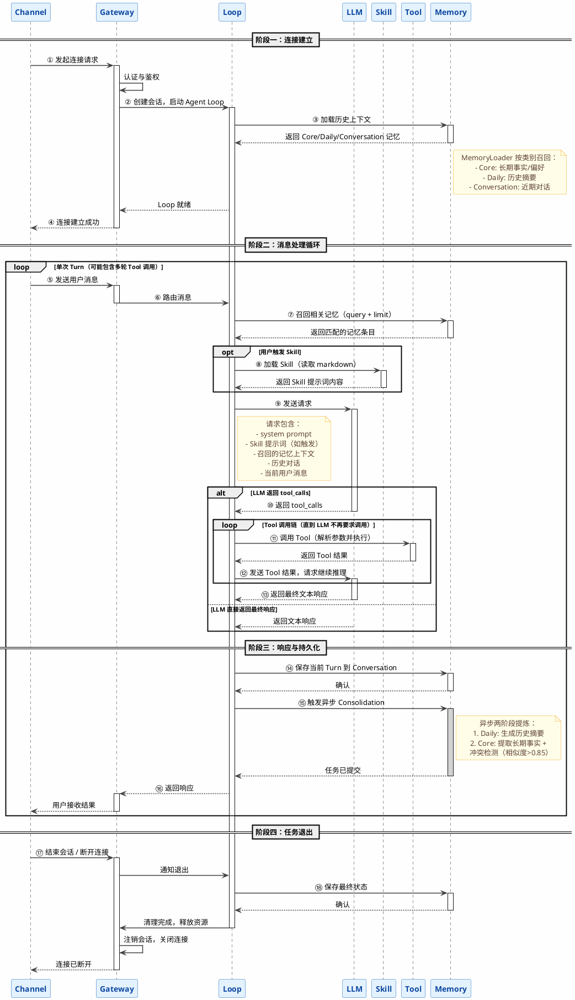

# Agent Loop 全流程图

> 本文档描述 ZeroClaw 智能体从连接建立到任务完成退出的完整交互流程。
> 采用序列图（Sequence Diagram）表达各组件之间的时序关系。

---

## 1. 整体流程概述

Agent Loop 是 ZeroClaw 的核心调度单元，负责协调 **Channel**（用户/外部系统接入层）、**Gateway**（网关与路由）、**LLM**（大模型推理）、**Skill**（业务技能）、**Tool**（底层工具）和 **Memory**（记忆存储）之间的交互。

一次完整的 Agent 生命周期分为四个阶段：

1. **连接建立**：用户接入，会话初始化，上下文预加载。
2. **消息处理循环**：接收用户输入，召回记忆，调用 LLM 推理，可能触发 Tool/Skill 调用链。
3. **响应与持久化**：返回结果给用户，同步/异步保存记忆。
4. **任务退出**：清理状态，归档数据，断开连接。

---

## 2. 序列图

---

## 3. 阶段详解

### 3.1 连接建立（①–④）

用户或外部系统通过 **Channel**（如 WebSocket、HTTP SSE、Discord、Telegram 等）发起连接。**Gateway** 负责认证鉴权，通过后创建会话并启动 **Agent Loop**。

Loop 启动时会立即向 **Memory** 请求加载上下文：
- **Core 记忆**：用户长期偏好、关键事实，注入 system prompt。
- **Daily 记忆**：历史会话摘要，帮助 Agent 了解近期背景。
- **Conversation 记忆**：当前会话的近期对话，维持上下文连贯性。

### 3.2 消息处理循环（⑤–⑬）

这是 Agent Loop 的核心，每次用户输入构成一个 **Turn**。一个 Turn 内部可能包含多轮 LLM 推理与 Tool/Skill 调用：

1. **消息路由**：Gateway 将用户消息转发给 Loop。
2. **记忆召回**：Loop 向 Memory 发送当前 query，召回最相关的记忆条目（混合搜索：BM25 + 向量相似度）。
3. **Skill 加载**：如果用户触发了某个 Skill（如输入 `/skill-name`），Loop 加载对应的 Skill markdown 文件，将其内容作为附加提示词。
4. **LLM 推理**：Loop 将 system prompt、Skill 提示词（如有）、召回的记忆、历史对话、当前用户消息组装后发送给 LLM。
5. **Tool 调用**：如果 LLM 返回 tool_calls，Loop 负责：
   - 解析调用目标和参数。
   - 执行 Tool 调用（文件读写、网络请求、计算等原子操作）。
   - 将 Tool 结果回注给 LLM，请求继续推理。
   - 重复直到 LLM 返回最终文本响应。

### 3.3 响应与持久化（⑭–⑯）

LLM 生成最终响应后，Loop 在返回给用户的同时，触发记忆的同步与异步写入：

| 操作 | 类型 | 说明 |
|------|------|------|
| 保存 Conversation | 同步 | 当前 Turn 的用户消息和助手回复写入短期对话记忆，支持按 session 隔离。 |
| Consolidation | 异步 | LLM 提炼本轮对话：① 生成 Daily 摘要；② 提取 Core 长期事实，并执行冲突检测（相似度 > 0.85 时标记旧记忆为 superseded）。 |

异步设计避免阻塞用户响应路径。

### 3.4 任务退出（⑰–⑱）

当用户主动结束会话或连接断开时：
- Gateway 通知 Loop 执行退出流程。
- Loop 将未持久化的状态同步写入 Memory。
- Memory 触发 Hygiene（归档与清理）。
- Gateway 注销会话，释放资源，关闭连接。

---

## 4. 关键设计要点

- **Loop 是唯一的调度中心**：所有跨组件通信都由 Loop 编排，避免组件之间直接耦合。
- **Memory 双轨写入**：Conversation 用于短期上下文，Core/Daily 用于长期知识积累，两者分离保证效率。
- **Skill 与 Tool 的分层**：Skill 是 markdown 格式的提示词指南（如代码评审、文档审阅指南），指导 LLM 的行为；Tool 是原子操作（如文件读写、HTTP 请求）。Skill 不直接执行任何操作，仅通过提示词影响 LLM 的推理方向和 tool_calls 生成。所有 Tool 调用必须由 Loop 解析并执行。
- **异步 Consolidation**：记忆提炼不阻塞主流程，由独立任务执行，失败不影响当前响应。
