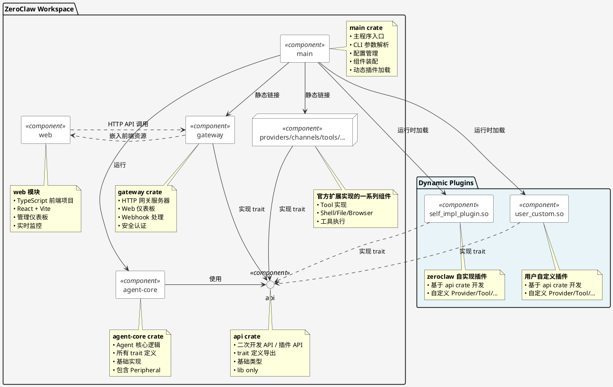

# ZeroClaw 架构重构方案

## 1. 重构目标

将当前单体架构的 ZeroClaw 项目拆分为多个独立的 crate，实现以下目标：

1. **架构解耦**：将核心逻辑与具体实现分离，提高模块化程度
2. **独立演进**：允许不同组件独立开发、测试和发布
3. **灵活部署**：支持按需选择组件，减少二进制体积
4. **清晰依赖**：明确组件间的依赖关系，避免循环依赖
5. **易于扩展**：降低扩展（Provider、Channel、Tool 等）难度，扩展代码与主程序发布解耦

## 2. 当前架构分析

### 2.1 现有模块结构

当前项目采用单体架构，主要模块包括：

- **核心模块**：`src/agent/` - Agent 核心逻辑和循环
- **可扩展 Trait**：
  - `src/providers/traits.rs` - Provider trait
  - `src/channels/traits.rs` - Channel trait
  - `src/tools/traits.rs` - Tool trait
  - `src/memory/traits.rs` - Memory trait
  - `src/runtime/traits.rs` - RuntimeAdapter trait
  - `src/peripherals/traits.rs` - Peripheral trait
  - `src/observability/traits.rs` - Observer trait
- **具体实现**：各模块下的具体实现（如 `src/providers/openai.rs`）
- **配置和主程序**：`src/config/`, `src/main.rs`

### 2.2 依赖关系分析

当前依赖关系较为复杂：
- 所有模块都直接依赖 `src/lib.rs` 中的公共类型
- 具体实现依赖对应的 trait 定义
- Agent 核心依赖所有 trait 和具体实现
- 存在循环依赖风险

## 3. 解耦思路

### 3.1 Crate 拆分策略

采用分层架构，将项目拆分为以下 crate：

```
zeroclaw/
├── Cargo.toml (workspace)
├── agent-core/           # 核心 Agent 逻辑和简单 trait 定义（包含 Peripheral）
├── providers/   # Provider 完整实现
├── channels/    # Channel 完整实现
├── tools/       # Tool 完整实现
├── memory/      # Memory 完整实现
├── runtime/     # RuntimeAdapter 完整实现
├── observability/ # Observer 完整实现
├── gateway/     # HTTP 网关服务器和 Web 仪表板
├── main/        # 主程序入口、CLI 和配置管理
└── web/         # TypeScript 前端项目（Web 客户端）
```

**说明**：
- `peripherals` 模块暂不单独拆分为 crate，保留在 `agent-core` 中
- 未来硬件外设功能将通过知识库 + skill + 工具的方式实现
- `web/` 目录是一个独立的 TypeScript 前端项目，使用 React + Vite + TailwindCSS
- `gateway/` crate 包含 HTTP 服务器和嵌入式 Web 仪表板

### 3.2 组件链接与加载策略

组件的链接和加载采用**混合策略**，平衡性能、灵活性和可维护性：

#### 3.2.1 ZeroClaw 自带扩展：静态链接

ZeroClaw 本身维护的各类扩展（providers、channels、tools、memory 等），原则上采用**静态链接**方式：

- 以 bin 的形式发布
- 通过配置文件决定启用哪些组件
- 编译时确定组件集合，运行时无动态加载开销

```
main crate
    ├── providers (static link)
    │       ├── openai provider ──▶ enabled via config
    │       ├── anthropic provider ──▶ disabled
    │       └── gemini provider ──▶ enabled via config
    ├── channels (static link)
    │       ├── telegram channel ──▶ enabled
    │       └── discord channel ──▶ disabled
    └── ...
```

**优势**：
- 编译期类型安全，无运行时 ABI 兼容性问题
- 性能最优，无动态加载开销
- 部署简单，单二进制文件即可运行
- 便于静态分析和优化

#### 3.2.2 用户二次开发扩展：动态加载

用户可基于 ZeroClaw 提供的 `api` crate 进行二次开发，生成动态库（`.so`/`.dll`/`.dylib`），由主程序**运行时动态加载**：

```
┌─────────────────────────────────────────────────────────────┐
│                        main crate                            │
│  ┌─────────────┐    ┌─────────────────────────────────────┐  │
│  │ api crate   │◀───┤ 用户二次开发依赖，提供 trait 定义   │  │
│  │ (lib only)  │    │ 和基础类型，用于构建动态库          │  │
│  └──────┬──────┘    └─────────────────────────────────────┘  │
│         │                                                    │
│         │ 动态加载                                           │
│         ▼                                                    │
│  ┌────────────────────────────────────────────────────────┐  │
│  │              Dynamic Plugin Loader                      │  │
│  │  ┌─────────────┐  ┌─────────────┐  ┌────────────────┐  │  │
│  │  │ user_custom │  │ company_ext │  │ third_party_xxx│  │  │
│  │  │ .so         │  │ .so         │  │ .so            │  │  │
│  │  │ (用户自定义)│  │ (企业扩展)  │  │ (第三方)       │  │  │
│  │  └─────────────┘  └─────────────┘  └────────────────┘  │  │
│  └────────────────────────────────────────────────────────┘  │
└─────────────────────────────────────────────────────────────┘
```

**实现要点**：
- 使用 `libloading` 或 `abi_stable` crate 实现跨平台动态加载
- 动态库需实现特定入口函数（如 `register_plugins()`）进行自注册
- 版本兼容性检查：动态库需声明兼容的 API 版本号

```rust
// 动态库入口示例
#[no_mangle]
pub extern "C" fn register_plugins(registry: &mut PluginRegistry) {
    registry.register_provider("custom_llm", || Box::new(CustomProvider::new()));
    registry.register_tool("custom_tool", || Box::new(CustomTool::new()));
}
```

#### 3.2.3 ZeroClaw 内部可选组件：动态加载

部分 ZeroClaw 自身维护但使用频率较低或代码体积庞大的组件，也采用**动态加载**方式：

**候选组件**（待定，需评估）：
| 组件 | 考虑动态加载的原因 | 评估状态 |
|------|-------------------|----------|
| 复杂浏览器自动化 | 依赖庞大（Chromium/Playwright），非所有场景需要 | 待评估 |
| 高级代码分析工具 | 依赖 LLVM/Tree-sitter，体积大 | 待评估 |
| 特定云服务商集成 | 使用频率低，SDK 体积大 | 待评估 |
| 实验性功能 | 不稳定，需频繁更新，避免重启主程序 | 待评估 |

**决策标准**：
- 代码体积 > 5MB 且非核心功能
- 启动时间影响显著（>100ms）
- 使用频率 < 20% 的典型部署场景
- 需要独立快速迭代，不耦合主版本发布

#### 3.2.4 策略对比与选型建议

| 策略 | 适用场景 | 优点 | 缺点 |
|------|---------|------|------|
| **静态链接** | 官方扩展、核心功能 | 性能最优、类型安全、部署简单 | 二进制体积大、需重新编译 |
| **动态加载（用户）** | 第三方扩展、定制 | 扩展灵活、无需重编主程序、隔离风险 | API 兼容性管理、调试复杂 |
| **动态加载（内部）** | 低频大体积组件 | 按需加载、减少基础体积、独立更新 | 运行时依赖管理、版本对齐 |


### 3.3 优化后系统组件图



**关键设计原则**：
1. **依赖倒置**：高层组件不依赖低层具体实现，都依赖 api 的抽象（trait）
2. **单一职责**：每个 crate 职责明确，边界清晰
3. **可插拔架构**：扩展组件可以独立开发、测试和部署
4. **配置驱动**：通过配置决定加载哪些组件，实现灵活部署
5. **前后端分离**：前端作为独立模块，通过 API 与后端交互

### 3.4 运行时目录结构

解耦后的 ZeroClaw 运行时采用分层目录结构，将可执行文件、配置文件、动态插件和用户数据分离，实现清晰的职责划分和易于管理的部署形态。

```
zeroclaw-workspace/               # 工作区根目录（可配置路径）
├── bin/
│   └── zeroclaw                  # 主程序可执行文件
├── config/
│   ├── config.toml               # 主配置文件（启用哪些组件）
│   └── plugins.d/                # 插件配置文件目录
│       ├── openai.toml
│       ├── telegram.toml
│       └── ...
├── plugin/
│       ├── providers/            # Provider 插件 (.so/.dll/.dylib)
│       │   ├── openai.so
│       │   └── custom_provider.so
│       │   ├── ...
│       ├── channels/             # Channel 插件
│       │   ├── telegram.so
│       │   ├── discord.so
│       │   └── ...
│       ├── tools/                # Tool 插件
│       │   ├── browser.so
│       │   └── enterprise_tools.so
│       │   └── ...
│       ├── memory/               # Memory 插件
│       │   ├── sqlite.so
│       │   └── qdrant.so
│       │   └── ...
├── skills/
├       |── skill-1/
├             |── SKILL.md
├             |── scripts/
├       |── skill-2/
├             |── SKILL.md
├             |── scripts/
├       |── ...
├── workspace/user1/              # 运行时工作数据
│   ├── memory/                   # 持久化记忆存储
│   │   ├── sessions/             # 会话历史
│   │   ├── vectors/              # 向量索引
│   │   └── cache/                # 嵌入缓存
│   ├── skills/                   # 用户动态创建的 skills
├       |── skill-1/
├             |── SKILL.md
├             |── scripts/
├       |── skill-2/
├             |── SKILL.md
├             |── scripts/
│   ├── logs/                     # 运行日志
│   │   ├── zeroclaw.log
│   │   └── archive/
│   ├── temp/                     # 临时文件
│   └── data/                     # 用户数据
│       ├── uploads/                  # 上传文件
│       ├── exports/                  # 导出数据
│       └── backups/                  # 自动备份
└── web/                          # Web 前端资源（gateway 使用）
    ├── index.html
    ├── assets/
    └── manifest.json
```

**目录职责说明**：

| 目录 | 用途 | 权限 | 持久化 |
|------|------|------|--------|
| `bin/` | 可执行文件 | 只读 | 随版本更新 |
| `config/` | 配置文件 | 读写 | 用户维护 |
| `lib/zeroclaw/` | 插件库 | 只读 | 随版本更新 |
| `workspace/memory/` | 记忆数据 | 读写 | 自动管理 |
| `workspace/skills/` | Skill 定义 | 读写 | 用户+自动 |
| `workspace/logs/` | 运行日志 | 追加 | 自动轮转 |
| `workspace/temp/` | 临时文件 | 读写 | 启动清理 |
| `workspace/state/` | 运行时状态 | 读写 | 重启清理 |
| `data/` | 用户数据 | 读写 | 用户维护 |

**配置文件示例**：

```toml
# config/config.toml
# 主配置：声明启用哪些组件

[provider]
# 使用静态链接的官方组件
name = "openai"
api_key = "${OPENAI_API_KEY}"

[[provider.plugins]]
# 动态加载的第三方 Provider
name = "custom_llm"
path = "lib/zeroclaw/third_party/custom_provider.so"
config_file = "config/plugins.d/custom_llm.toml"

[channel]
# 启用多个 Channel
enabled = ["telegram", "discord"]

[[channel.plugins]]
name = "enterprise_wechat"
path = "lib/zeroclaw/third_party/enterprise_wechat.so"

[tools]
enabled = ["shell", "file", "browser"]

[memory]
type = "sqlite"
path = "workspace/memory/sessions.db"

[workspace]
# 工作区路径（可自定义）
path = "/var/lib/zeroclaw"
memory_dir = "memory"
skills_dir = "skills"
logs_dir = "logs"
temp_dir = "/tmp/zeroclaw"
```

**启动流程中的目录初始化**：

```rust
// main crate 启动时初始化目录结构
fn initialize_workspace(base_path: &Path) -> Result<Workspace> {
    // 1. 确保目录结构存在
    fs::create_dir_all(base_path.join("workspace/memory/sessions"))?;
    fs::create_dir_all(base_path.join("workspace/skills"))?;
    fs::create_dir_all(base_path.join("workspace/logs"))?;
    fs::create_dir_all(base_path.join("workspace/temp"))?;
    fs::create_dir_all(base_path.join("workspace/state"))?;

    // 2. 清理临时文件
    cleanup_temp_files(base_path.join("workspace/temp"))?;

    // 3. 加载配置文件
    let config = load_config(base_path.join("config/config.toml"))?;

    // 4. 扫描并加载插件
    let plugin_dirs = vec![
        base_path.join("lib/zeroclaw/providers"),
        base_path.join("lib/zeroclaw/channels"),
        base_path.join("lib/zeroclaw/tools"),
        base_path.join("lib/zeroclaw/memory"),
        base_path.join("lib/zeroclaw/third_party"),
    ];
    let plugins = load_plugins(&plugin_dirs, &config)?;

    // 5. 初始化工作空间句柄
    Ok(Workspace {
        base_path: base_path.to_path_buf(),
        memory: MemoryStore::new(base_path.join("workspace/memory")),
        skills: SkillManager::new(base_path.join("workspace/skills")),
        logs: LogManager::new(base_path.join("workspace/logs")),
        temp: TempDir::new(base_path.join("workspace/temp")),
    })
}
```

**设计考虑**：
1. **XDG 兼容**：遵循 XDG Base Directory 规范，支持 `XDG_DATA_HOME`、`XDG_CONFIG_HOME` 等环境变量
2. **容器友好**：所有路径可配置，便于 Docker 挂载卷映射
3. **权限最小化**：可执行文件和库只读，数据目录独立
4. **备份友好**：`workspace/` 和 `data/` 分离，便于选择性备份
5. **多实例支持**：通过不同工作区路径支持多实例部署

## 4. 解耦方案

### 4.1 解耦后目录结构

重构后的 ZeroClaw 采用 Cargo Workspace 管理多 crate 结构，根目录下的 `Cargo.toml` 定义 workspace 成员。

```
zeroclaw/
├── Cargo.toml              # Workspace 定义，统一版本管理
├── Cargo.lock              # 共享依赖锁定
├── tests/                  # 跨 crate 集成测试
├── dev/                    # 开发工具脚本
├── docs/                   # 文档
├── web/                    # TypeScript 前端项目（独立）
└── crates/                 # Rust crate 目录
    ├── agent-core/         # 核心 Agent 逻辑和 trait 定义
    ├── providers/          # Provider 实现（OpenAI/Anthropic/Gemini 等）
    ├── channels/           # Channel 实现（Telegram/Discord/Slack 等）
    ├── tools/              # Tool 实现（Shell/File/Browser 等）
    ├── memory/             # Memory 实现（SQLite/Postgres/Qdrant 等）
    ├── runtime/            # Runtime 实现（Native/Docker）
    ├── observability/      # 可观测性实现（Log/Prometheus/OTel）
    ├── gateway/            # HTTP 网关服务器和 Web 仪表板
    ├── api/                # 聚合API lib，用于发布 API 给产品二次开发使用
    └── main/               # 主程序入口、CLI 和配置管理
```

### 4.2 扩展组件的加载、注册和使用

以 `providers` 为例，说明扩展组件的加载、注册和使用机制。该机制采用**注册表模式（Registry Pattern）**，支持静态链接和动态加载两种方式。

#### 4.2.0 两种加载方式概述

根据第 3.3 节的混合策略，扩展组件有两种接入方式：

| 方式 | 适用对象 | 注册时机 | 技术实现 |
|------|---------|---------|---------|
| **静态注册** | ZeroClaw 官方 crate | 编译期 | `init()` 函数调用 `registry.register()` |
| **动态注册** | 用户动态库 | 运行时 | `libloading` 加载后调用 `register_plugins()` |

#### 4.2.1 整体设计（静态链接方式）

```
┌─────────────────────────────────────────────────────────────────────────┐
│                              main crate                                  │
│  ┌─────────────┐    ┌─────────────────┐    ┌─────────────────────────┐  │
│  │ config.toml │───▶│ 读取 provider   │───▶│ 创建 PluginRegistry     │  │
│  │             │    │ name = "openai" │    │                         │  │
│  └─────────────┘    └─────────────────┘    └─────────────────────────┘  │
│                                                    │                     │
│              ┌─────────────────────────────────────┘                     │
│              ▼                                                           │
│  ┌────────────────────────────────────────────────────────────────────┐  │
│  │ 调用 providers::init()                                              │  │
│  │ 调用 channels::init()  ...  各扩展 crate 自行注册                     │  │
│  └────────────────────────────────────────────────────────────────────┘  │
│                                                    │                     │
│              ┌─────────────────────────────────────┘                     │
│              ▼                                                           │
│  ┌────────────────────────────────────────────────────────────────────┐  │
│  │ 获取组件: registry.get<Provider>("openai", cfg)                    │  │
│  │ 组装 Agent: AgentBuilder::new().provider(provider).build()         │  │
│  │ 运行: agent.run()                                                  │  │
│  └────────────────────────────────────────────────────────────────────┘  │
└─────────────────────────────────────────────────────────────────────────┘
       │                                           ▲
       │                                           │
       ▼                                           │
┌─────────────────────────────────────────────────────────────────────────┐
│                         api crate                                       │
│  ┌────────────────────────────────────────────────────────────────────┐  │
│  │                        PluginRegistry                               │  │
│  │  ┌──────────────────┐    ┌───────────────────────────────────────┐  │
│  │  │ register<T>()    │◀───│  各扩展 crate 调用                    │  │
│  │  │   name, factory  │    │  注册自己的工厂函数                   │  │
│  │  └──────────────────┘    └───────────────────────────────────────┘  │
│  │  ┌──────────────────┐    ┌───────────────────────────────────────┐  │
│  │  │ get<T>()         │───▶│  根据 name 返回 Box<dyn Trait>        │  │
│  │  │   name, config   │    │  供 main crate 组装使用               │  │
│  │  └──────────────────┘    └───────────────────────────────────────┘  │
│  └────────────────────────────────────────────────────────────────────┘  │
└─────────────────────────────────────────────────────────────────────────┘
       ▲                                           │
       │                                           │
       │ 实现 Provider trait                        │ 注册 Provider
       │                                           │
┌─────────────────────────────────────────────────────────────────────────┐
│                        providers crate                                   │
│  ┌─────────────────────────┐  ┌──────────────────────────────────────┐  │
│  │  pub fn init(registry)  │  │  初始化时注册所有 Provider:          │  │
│  │  由 main 调用           │  │  - registry.register("openai", ...)  │  │
│  │                         │  │  - registry.register("gemini", ...)  │  │
│  └─────────────────────────┘  └──────────────────────────────────────┘  │
│         │                                                            │
│         ▼                                                            │
│  ┌────────────────┐    ┌────────────────┐    ┌────────────────────┐  │
│  │   openai.rs    │    │  anthropic.rs  │    │     gemini.rs      │  │
│  │ 实现 Provider  │    │ 实现 Provider  │    │   实现 Provider    │  │
│  └────────────────┘    └────────────────┘    └────────────────────┘  │
└─────────────────────────────────────────────────────────────────────────┘
```

#### 4.2.1a 动态加载方式

```
┌─────────────────────────────────────────────────────────────────────────┐
│                              main crate                                  │
│  ┌───────────────────────────────────────────────────────────────────┐  │
│  │                     Dynamic Plugin Loader                          │  │
│  │  1. 扫描插件目录 ./plugins/*.so                                    │  │
│  │  2. 验证 API 版本兼容性                                            │  │
│  │  3. 调用 register_plugins(registry)                                │  │
│  │  4. 注册到同一 PluginRegistry                                      │  │
│  └───────────────────────────────────────────────────────────────────┘  │
└─────────────────────────────────────────────────────────────────────────┘
       │                                           │
       │ libloading::Library::open()               │
       │                                           │
       ▼                                           │
┌─────────────────────────────────────────────────────────────────────────┐
│                       用户动态库 (.so/.dll)                              │
│  ┌───────────────────────────────────────────────────────────────────┐  │
│  │ #[no_mangle]                                                      |  |
|  | pub extern "C" fn register_plugins(registry) {                    │  │
│  │     registry.register("custom_llm", || Box::new(CustomProvider)); │  │
│  │ }                                                                  │  │
│  └───────────────────────────────────────────────────────────────────┘  │
└─────────────────────────────────────────────────────────────────────────┘
```

#### 4.2.2 api 提供 PluginRegistry

`api` 定义统一的插件注册表，支持任何可扩展 trait（Provider、Channel、Tool 等）的注册与获取。

```rust
// api/src/plugin.rs

/// 工厂函数类型：接收配置，返回 trait 对象
pub type Factory<T, C> = Arc<dyn Fn(&C) -> Result<Box<T>> + Send + Sync>;

/// 插件注册表（全局单例）
pub struct PluginRegistry<T, C> {
    factories: RwLock<HashMap<String, Factory<T, C>>>,
}

impl<T, C> PluginRegistry<T, C> {
    /// 创建空注册表
    pub fn new() -> Self {
        Self {
            factories: RwLock::new(HashMap::new()),
        }
    }

    /// 注册 trait 实现的工厂函数
    ///
    /// # Arguments
    /// * `name` - 组件标识名（如 "openai", "anthropic"）
    /// * `factory` - 创建 trait 对象的工厂函数
    pub fn register<F>(&self, name: impl Into<String>, factory: F)
    where
        F: Fn(&C) -> Result<Box<T>> + Send + Sync + 'static,
    {
        let mut factories = self.factories.write().unwrap();
        factories.insert(name.into(), Arc::new(factory));
    }

    /// 获取 trait 实现
    ///
    /// # Arguments
    /// * `name` - 组件标识名
    /// * `config` - 组件配置
    ///
    /// # Returns
    /// * `Ok(Box<T>)` - trait 对象
    /// * `Err` - 未找到或创建失败
    pub fn get(&self, name: &str, config: &C) -> Result<Box<T>> {
        let factories = self.factories.read().unwrap();
        let factory = factories
            .get(name)
            .ok_or_else(|| anyhow::anyhow!("Provider '{}' not registered", name))?;
        factory(config)
    }
}

// 为 Provider 提供类型别名简化使用
pub type ProviderRegistry<C> = PluginRegistry<dyn Provider, C>;
```

#### 4.2.3 扩展组件实现 init 方法注册自身

`providers` crate 在初始化时，将各 Provider 实现注册到 `PluginRegistry`。

```rust
// providers/src/lib.rs

use liteclaw::plugin::ProviderRegistry;
use liteclaw::ProviderConfig;

/// providers crate 初始化入口
/// 由 main crate 在启动时调用
pub fn init(registry: &ProviderRegistry<ProviderConfig>) {
    // 注册 OpenAI Provider
    registry.register("openai", |config| {
        let provider = OpenAiProvider::new(config)?;
        Ok(Box::new(provider))
    });

    // 注册 OpenRouter Provider（多模型聚合）
    registry.register("openrouter", |config| {
        let provider = OpenRouterProvider::new(config)?;
        Ok(Box::new(provider))
    });

    // 其他 Provider...
}
```

#### 4.2.4 main crate 组装与使用

`main` crate 负责：
1. 初始化 `PluginRegistry`
2. 调用各扩展 crate 的 `init()` 完成注册
3. 从配置读取 Provider 名称，调用 `get()` 获取实例

```rust
// main/src/main.rs

use liteclaw::plugin::ProviderRegistry;
use liteclaw::ProviderConfig;

fn main() -> Result<()> {
    // 1. 加载配置
    let config = load_config()?;

    // 2. 创建注册表
    let provider_registry = ProviderRegistry<ProviderConfig>::new();

    // 3. 初始化各扩展 crate，完成注册
    providers::init(&config);
    // channels::init(&channel_registry);
    // tools::init(&tool_registry);
    // ...

    // 4. 根据配置获取 Provider 实例
    let provider_name = &config.provider.name; // "openai"
    let provider_config = &config.provider.config;

    let provider = provider_registry.get(provider_name, provider_config)
        .expect(&format!("Failed to create provider: {}", provider_name));

    // 5. 组装 Agent 并运行
    let agent = AgentBuilder::new()
        .provider(provider)
        // .channel(channel)
        // .tools(tools)
        .build()?;

    agent.run().await?;

    Ok(())
}
```

#### 4.2.5 该机制的优势

| 优势 | 说明 |
|------|------|
| **编译期解耦** | `agent-core` 不依赖任何具体 Provider 实现 |
| **运行时组装** | 通过配置决定加载哪些组件，实现灵活部署 |
| **扩展友好** | 新增 Provider 只需在 `providers` crate 添加实现并注册，无需修改 `agent-core` |
| **类型安全** | 使用泛型 trait 保证编译期类型检查 |
| **易于测试** | 可注入 Mock 实现进行单元测试 |

### 4.3 各 Crate 详细设计

#### 4.3.1 `api` crate

**职责**：
- **二次开发 SDK**：为第三方开发者提供构建插件的 API 接口
- **Trait 定义导出**：导出所有可扩展组件的 trait 定义（Provider、Channel、Tool、Memory 等）
- **基础类型定义**：定义插件开发所需的基础类型、配置结构、错误类型
- **插件注册机制**：提供 `PluginRegistry` 统一注册表，支持静态链接和动态加载两种模式
- **版本管理**：定义 API 版本号，用于动态库兼容性检查

**设计原则**：
1. **最小依赖**：仅保留 trait 定义和基础类型，不包含任何具体实现
2. **稳定 ABI**：使用 C ABI 兼容的接口，确保动态库跨版本兼容
3. **零成本抽象**：静态链接时无运行时开销
4. **lib only**：纯库 crate，不包含可执行入口

**依赖**：
- `serde`, `async-trait`, `anyhow`, `thiserror`（基础类型和错误处理）

**不依赖**：
- 任何具体实现（Provider、Channel、Tool 等）
- Agent 核心逻辑
- 主程序逻辑
- 外部服务（HTTP、数据库等）

**关键文件结构**：
```
api/
├── src/
│   ├── lib.rs              # 库入口，导出所有公开 API
│   ├── traits/
│   │   ├── mod.rs
│   │   ├── provider.rs     # Provider trait 定义
│   │   ├── channel.rs      # Channel trait 定义
│   │   ├── tool.rs         # Tool trait 定义
│   │   ├── memory.rs       # Memory trait 定义
│   │   ├── runtime.rs      # RuntimeAdapter trait 定义
│   │   ├── peripheral.rs   # Peripheral trait 定义
│   │   └── observer.rs     # Observer trait 定义
│   ├── plugin.rs           # PluginRegistry 实现
│   ├── types.rs            # 基础类型定义（配置、消息等）
│   ├── version.rs          # API 版本管理
│   └── error.rs            # 错误类型定义
└── Cargo.toml
```

**使用场景**：

1. **官方扩展开发**：`providers`、`channels` 等官方 crate 依赖 api，实现其中定义的 trait
2. **用户二次开发**：用户基于 api crate 开发自定义插件，编译为动态库（`.so`/`.dll`）
3. **动态加载**：main crate 通过 api 提供的接口加载和调用用户插件

---

#### 4.3.2 `agent-core` crate

**职责**：
- 定义核心 Agent 结构（Agent, AgentBuilder）
- 定义 Agent 循环逻辑
- **引用 api crate 的 trait** 实现 Agent 功能
- 提供工具分发器（ToolDispatcher）
- 提供内存加载器（MemoryLoader）
- 提供系统提示构建器（SystemPromptBuilder）

**设计原则**：
1. **最小接口**：每个 trait 只定义最核心的方法，避免复杂功能
2. **真实可用的基础实现**：为每个 trait 提供功能完整、生产就绪的基础实现
   - Provider: OpenAI 兼容接口实现
   - Channel: CLI 交互实现
   - Tool: Shell 工具实现
   - Memory: 本地文件系统存储实现
   - Runtime: 本地运行时实现
   - Observer: 控制台观察者实现
3. **零依赖**：不依赖任何具体实现或外部服务
4. **标准兼容**：基础实现遵循行业标准接口

**依赖**：
- `serde`, `async-trait`, `anyhow`, `thiserror`
- `tokio`（仅 async 运行时）

**不依赖**：
- 任何具体实现（Provider、Channel、Tool 等）
- 配置管理
- 主程序逻辑
- 外部服务（HTTP、数据库等）

**关键文件结构**：
```
agent-core/
├── src/
│   ├── lib.rs
│   ├── agent.rs          # Agent 核心结构
│   ├── loop.rs           # Agent 循环逻辑
│   ├── traits/
│   │   ├── mod.rs
│   │   ├── provider.rs   # Provider trait + OpenAI兼容实现
│   │   ├── channel.rs    # Channel trait + CLI交互实现
│   │   ├── tool.rs       # Tool trait + Shell工具实现
│   │   ├── memory.rs     # Memory trait + 本地文件存储实现
│   │   ├── runtime.rs    # RuntimeAdapter trait + 本地运行时实现
│   │   ├── peripheral.rs # Peripheral trait + 基础实现
│   │   └── observer.rs   # Observer trait + 控制台观察者实现
│   ├── dispatcher/
│   │   ├── mod.rs
│   │   ├── native.rs     # NativeToolDispatcher
│   │   └── xml.rs        # XmlToolDispatcher
│   ├── memory_loader/
│   │   ├── mod.rs
│   │   └── default.rs    # DefaultMemoryLoader
│   ├── prompt/
│   │   ├── mod.rs
│   │   └── builder.rs    # SystemPromptBuilder
└── Cargo.toml
```

#### 4.3.3 扩展组件 Crate（以 `providers` 为例）

**职责**：
- 实现 `agent-core` 中定义的 Provider trait
- 提供具体 Provider 实现（OpenAI、Anthropic、Gemini 等）
- 提供 Provider 工厂函数
- 提供 Provider 路由功能

**依赖**：
- `agent-core`（仅 trait 定义）
- `reqwest`, `serde_json` 等 HTTP 和序列化库
- 特定 Provider 的 SDK（可选）

**关键文件结构**：
```
providers/
├── src/
│   ├── lib.rs
│   ├── factory.rs        # Provider 工厂
│   ├── router.rs         # Provider 路由
│   ├── implementations/
│   │   ├── mod.rs
│   │   ├── openai.rs
│   │   ├── anthropic.rs
│   │   ├── gemini.rs
│   │   └── openrouter.rs
│   └── utils/
│       └── mod.rs
└── Cargo.toml
```

#### 4.3.4 `gateway` crate

**职责**：
- HTTP 网关服务器，提供 REST API 和 WebSocket 接口
- 嵌入式 Web 仪表板，提供可视化管理和监控界面
- Webhook 处理，支持多种消息渠道（WhatsApp、Linq、WATI、Nextcloud Talk 等）
- 安全认证和速率限制
- 静态文件服务，嵌入前端构建产物

**设计原则**：
1. **安全性优先**：内置配对机制、Bearer Token 认证、Webhook 签名验证
2. **性能优化**：请求体大小限制、请求超时、速率限制
3. **可扩展性**：模块化路由设计，支持多种 Webhook 处理器
4. **实时通信**：支持 WebSocket 和 Server-Sent Events (SSE)

**依赖**：
- `axum`, `tower`, `tower-http`（HTTP 服务器）
- `tokio`（异步运行时）
- `rust-embed`, `mime_guess`（前端资源嵌入）
- `tokio-tungstenite`（WebSocket）
- `zeroclaw-agent-core`（核心 trait 定义）
- 其他扩展组件 crate（按需，通过 feature flags 控制）

**关键文件结构**：
```
gateway/
├── src/
│   ├── lib.rs
│   ├── server.rs        # 网关服务器启动和配置
│   ├── state.rs         # 应用状态管理
│   ├── routes/
│   │   ├── mod.rs
│   │   ├── api.rs       # REST API 路由
│   │   ├── webhook.rs   # Webhook 路由
│   │   ├── ws.rs        # WebSocket 路由
│   │   └── sse.rs       # Server-Sent Events 路由
│   ├── handlers/
│   │   ├── mod.rs
│   │   ├── pair.rs      # 配对处理器
│   │   ├── health.rs    # 健康检查
│   │   └── metrics.rs   # Prometheus 指标
│   ├── middleware/
│   │   ├── mod.rs
│   │   ├── auth.rs      # 认证中间件
│   │   ├── rate_limit.rs # 速率限制中间件
│   │   └── logging.rs   # 日志中间件
│   ├── static_files.rs  # 静态文件服务
│   └── utils/
│       └── mod.rs
└── Cargo.toml
```

**前端集成设计**：
1. **构建时嵌入**：前端项目（`web/`）构建产物在编译时嵌入到二进制中
2. **SPA 支持**：单页应用路由，非 API 请求返回 `index.html`
3. **缓存优化**：静态资源使用 immutable 缓存，HTML 文件不缓存

#### 4.3.5 `web` 模块（TypeScript 前端项目）

**职责**：
- 提供 ZeroClaw 的 Web 管理仪表板
- 实时监控 Agent 状态和活动
- 配置管理和工具管理界面
- 成本跟踪和内存查看
- 集成测试和诊断工具

**技术栈**：
- **框架**：React 19 + TypeScript
- **构建工具**：Vite 6
- **样式**：TailwindCSS 4
- **路由**：React Router 7
- **图标**：Lucide React
- **HTTP 客户端**：原生 Fetch API + 自定义 hooks

**项目结构**：
```
web/
├── package.json
├── vite.config.ts
├── tsconfig.json
├── index.html
├── src/
│   ├── main.tsx        # 应用入口
│   ├── App.tsx         # 根组件
│   ├── index.css       # 全局样式
│   ├── vite-env.d.ts   # Vite 类型定义
│   ├── lib/
│   │   ├── api.ts      # API 客户端
│   │   ├── auth.ts     # 认证工具
│   │   ├── sse.ts      # SSE 连接
│   │   ├── ws.ts       # WebSocket 连接
│   │   └── i18n.ts     # 国际化
│   ├── hooks/
│   │   ├── useApi.ts   # API hook
│   │   ├── useAuth.ts  # 认证 hook
│   │   ├── useSSE.ts   # SSE hook
│   │   └── useWebSocket.ts # WebSocket hook
│   ├── components/
│   │   ├── layout/
│   │   │   ├── Layout.tsx    # 布局组件
│   │   │   ├── Header.tsx    # 头部
│   │   │   └── Sidebar.tsx   # 侧边栏
│   │   └── common/           # 通用组件
│   ├── pages/
│   │   ├── Dashboard.tsx     # 仪表板
│   │   ├── AgentChat.tsx     # Agent 聊天
│   │   ├── Config.tsx        # 配置管理
│   │   ├── Tools.tsx         # 工具管理
│   │   ├── Memory.tsx        # 内存查看
│   │   ├── Cost.tsx          # 成本跟踪
│   │   ├── Cron.tsx          # 定时任务
│   │   ├── Integrations.tsx  # 集成管理
│   │   ├── Logs.tsx          # 日志查看
│   │   └── Doctor.tsx        # 诊断工具
│   └── types/
│       └── api.ts      # API 类型定义
└── dist/               # 构建输出目录
```

**关键特性**：
1. **实时更新**：通过 WebSocket 和 SSE 实现实时数据更新
2. **响应式设计**：适配桌面和移动设备
3. **离线支持**：基本的离线功能
4. **国际化**：支持多语言
5. **主题切换**：明暗主题支持

#### 4.3.6 `main` crate

**职责**：
- 主程序入口点
- CLI 参数解析
- 服务管理（daemon、service）
- **配置管理**：定义配置结构、加载、验证、序列化
- 组件初始化和装配（静态链接组件）
- **动态插件加载器**：扫描、加载、验证动态库（见 3.3.2、3.3.3）
- 与环境变量和文件系统交互

**依赖**：
- `agent-core`（Agent 核心）
- 所有扩展组件 crate（按需，静态链接）
- `api`（用于动态插件接口定义）
- `clap`（CLI 解析）
- `serde`, `toml`, `schemars`（配置序列化）
- `directories`, `shellexpand`（环境交互）
- `libloading`（动态库加载，可选依赖）

**关键文件结构**：
```
main/
├── src/
│   ├── main.rs              # 程序入口点
│   ├── cli.rs               # CLI 参数解析
│   ├── config/
│   │   ├── mod.rs           # 配置模块入口
│   │   ├── schema.rs        # 配置结构定义
│   │   ├── loader.rs        # 配置加载和验证
│   │   ├── validator.rs     # 配置验证逻辑
│   │   └── merger.rs        # 配置合并（环境变量、文件、CLI）
│   ├── service/
│   │   ├── mod.rs           # 服务管理
│   │   ├── daemon.rs        # 守护进程管理
│   │   └── installer.rs     # 服务安装/卸载
│   ├── assembly/
│   │   ├── mod.rs           # 组件装配
│   │   ├── factory.rs       # 组件工厂（静态）
│   │   └── resolver.rs      # 依赖解析
│   ├── plugin_loader/       # 【新增】动态插件加载器
│   │   ├── mod.rs           # 加载器入口
│   │   ├── scanner.rs       # 插件目录扫描
│   │   ├── loader.rs        # 动态库加载（libloading封装）
│   │   ├── validator.rs     # API版本兼容性验证
│   │   └── registry.rs      # 动态插件注册到PluginRegistry
│   └── utils/
│       └── mod.rs           # 工具函数
└── Cargo.toml
```

**配置管理设计**：
1. **统一配置**：所有配置集中在 main crate 中管理
2. **分层加载**：支持默认配置 → 配置文件 → 环境变量 → CLI 参数的优先级
3. **运行时验证**：配置加载时进行类型和业务逻辑验证

**动态插件加载器设计**：
```rust
// main/src/plugin_loader/mod.rs

pub struct DynamicPluginLoader {
    plugin_dirs: Vec<PathBuf>,
    api_version: Version,
}

impl DynamicPluginLoader {
    /// 扫描并加载所有动态插件
    pub fn load_all(&self, registry: &mut PluginRegistry) -> Result<Vec<PluginInfo>> {
        let mut loaded = vec![];
        for dir in &self.plugin_dirs {
            for entry in fs::read_dir(dir)? {
                let path = entry?.path();
                if self.is_valid_plugin(&path) {
                    let info = self.load(&path, registry)?;
                    loaded.push(info);
                }
            }
        }
        Ok(loaded)
    }

    /// 验证API版本兼容性
    fn check_compatibility(&self, plugin_version: &Version) -> Result<()> {
        // 主版本号必须一致
        if plugin_version.major != self.api_version.major {
            bail!("API version mismatch: expected {}, got {}",
                  self.api_version, plugin_version);
        }
        Ok(())
    }
}
```

### 4.4 渐进式实施建议

为避免大规模重构带来的风险，建议采用以下渐进式步骤逐步完成架构解耦：

#### 步骤 1：创建 Workspace

将现有 `zeroclaw` 项目转换为 Cargo Workspace。

```bash
# 创建 workspace 根目录
mkdir liteclaw
cd liteclaw

# 创建 Cargo.toml 定义 workspace
cat > Cargo.toml << 'EOF'
[workspace]
members = [
    "zeroclaw",
]
resolver = "2"

[workspace.dependencies]
# 后续添加共享依赖
EOF

# 将原项目移入 workspace
mv /path/to/original/zeroclaw zeroclaw/
```

此时 workspace 只包含一个 crate（原有的 zeroclaw），项目可正常编译运行。

#### 步骤 2：创建 api crate，迁移 trait 定义

1. 创建 api crate 目录结构：
```bash
cargo new --lib crates/api
```

修改 `Cargo.toml` ，设置库名为 `liteclaw`
```toml
[package]
name = "liteclaw-api"   # 包名

[lib]
name = "liteclaw"       # 库 crate 的名称
```

2. 将 zeroclaw 中支持扩展的 trait 移动到 api crate：
   - `src/providers/traits.rs` → `crates/api/src/traits/provider.rs`
   - `src/channels/traits.rs` → `crates/api/src/traits/channel.rs`
   - `src/tools/traits.rs` → `crates/api/src/traits/tool.rs`
   - `src/memory/traits.rs` → `crates/api/src/traits/memory.rs`
   - 其他 trait 同理

3. 更新 `crates/api/src/lib.rs` 导出所有 trait：
```rust
pub mod traits;
```

4. 修改 zeroclaw 的 `Cargo.toml`，将依赖改为 api crate：
```toml
[dependencies]
liteclaw-api = { path = "../crates/api" }
```

5. 更新 zeroclaw 中的导入语句：
```rust
// 修改前
use crate::providers::Provider;

// 修改后
use liteclaw::traits::Provider;
```

#### 步骤 3：在 api 中实现插件管理模块

1. 在 api crate 中创建插件注册表

2. 添加版本管理模块：
```rust
// crates/api/src/version.rs
pub const API_VERSION: &str = env!("CARGO_PKG_VERSION");
```

3. 更新 `crates/api/src/lib.rs` 导出插件模块：
```rust
pub mod plugin;
pub mod version;
```

4. 修改zeroclaw main 扫描和加载插件

#### 步骤 4：创建其他 crate，迁移特定功能

按以下顺序逐步创建和迁移：

**阶段 4.1：创建 agent-core crate**
```bash
cargo new --lib crates/agent-core
```
- 迁移 `src/agent/` 核心逻辑
- 迁移基础 trait 实现（如 CLI Channel、Shell Tool 等）
- 更新 zeroclaw 依赖 agent-core

**阶段 4.2：创建 providers crate**
```bash
cargo new --lib crates/providers
```
- 迁移 `src/providers/` 下的具体实现
- 实现 `init()` 函数注册所有 Provider
- 更新 zeroclaw 依赖 providers

**阶段 4.3：创建其他扩展 crate**
依次创建：
- `crates/channels/` - 迁移 Channel 实现
- `crates/tools/` - 迁移 Tool 实现
- `crates/memory/` - 迁移 Memory 实现
- `crates/gateway/` - 迁移 Gateway 实现
- `crates/main/` - 迁移主程序入口（最终 zeroclaw 变为 main crate）

**阶段 4.4：重构主程序**
- 将原 zeroclaw 重命名为 main
- 在主程序中初始化 PluginRegistry
- 调用各 crate 的 `init()` 完成注册
- 根据配置组装 Agent

**验证点**：
每个阶段完成后运行 `cargo build` 和 `cargo test`，确保项目可正常编译和测试通过。

---

## 5. 技术挑战和解决方案

### 5.1 循环依赖问题

**问题**：扩展组件可能需要相互引用（如 Tool 需要 Memory）

**解决方案**：
- 使用 `agent-core` 中的 trait 作为中介
- 通过依赖注入传递所需组件
- 避免在 trait 定义中直接引用其他具体类型

### 5.2 版本管理

**问题**：多个 crate 需要协调版本

**解决方案**：
- 使用 workspace 统一管理版本
- 所有 crate 共享主要版本号
- 通过 CI 确保版本兼容性

### 5.3 测试策略

**问题**：跨 crate 的集成测试

**解决方案**：
- 在 workspace 根目录维护集成测试
- 每个 crate 维护单元测试
- 使用 mock 对象测试 trait 实现

### 5.4 动态加载的 ABI 兼容性

**问题**：动态库与主程序之间的 ABI 兼容性问题

**具体挑战**：
1. **Rust 无稳定 ABI**：Rust 尚未提供稳定的 C ABI 之外的 ABI
2. **trait 对象跨动态库边界**：`Box<dyn Trait>` 在动态库间传递存在风险
3. **版本不匹配**：动态库编译时依赖的 `api` crate 版本与主程序不一致
4. **编译器差异**：不同 Rust 编译器版本可能产生不兼容的符号

**解决方案**：

| 层面 | 策略 | 说明 |
|------|------|------|
| **API 设计** | C ABI 兼容 | 动态库入口使用 `#[no_mangle] extern "C"` |
| **版本控制** | 语义化版本检查 | 动态库导出 `api_version()`，主程序验证主版本一致 |
| **类型安全** | 不透明指针 | 使用 `*mut c_void` + vtable 封装，避免直接传递 trait 对象 |
| **工具链** | abi_stable crate | 考虑使用 `abi_stable` 提供稳定的 Rust ABI |

## 6. 收益分析

### 6.1 架构收益

1. **清晰的模块边界**：每个 crate 职责单一
2. **独立的演进能力**：可以单独更新某个组件
3. **更好的代码组织**：相关代码集中在一起
4. **减少编译耦合**：修改一个组件不影响其他组件

### 6.2 开发收益

1. **更快的增量编译**：只编译修改的 crate
2. **并行开发**：不同团队可以同时开发不同组件
3. **简化认知负荷**：更小的组件能够降低学习成本，更易于学习和维护
4. **更适配AI开发**：职责单一的小组件，更利于使用AI开发

### 6.3 部署收益

1. **减少二进制体积**：去除未使用的组件
2. **灵活的发布策略**：可以单独发布某个组件
3. **更好的依赖管理**：明确的外部依赖

## 7. 后续优化方向

1. **WASM 支持**：将部分组件编译为 WASM
2. **与 CPPAgent 集成**：为与 CPPAgent SDK 集成提供基础
3. **新增 RAG trait 扩展**：在 agent-core 增加 RAG trait 和基础实现
4. **Peripherals 拆分**：当前不将其作为crate拆分，保留在 agent-core 中，未来通过 知识库 + skill + 工具实现。
