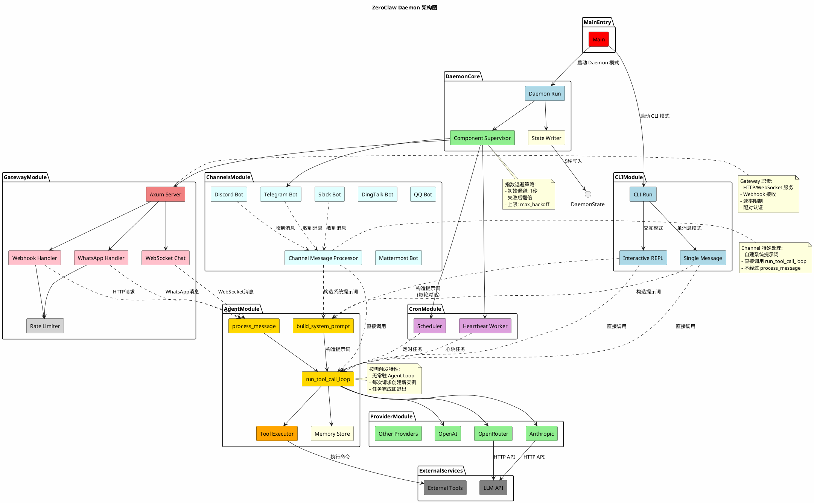
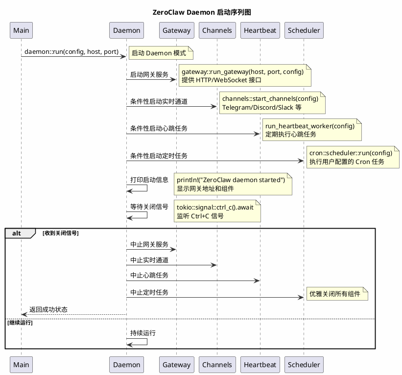

# Daemon Run 流程

本文档详细说明 ZeroClaw daemon 的启动和运行流程。

## 函数签名

```rust
pub async fn run(config: Config, host: String, port: u16) -> Result<()>
```


## 架构图



### 架构说明

**分层架构：**

| 层级 | 组件 | 职责 |
|------|------|------|
| **入口层** | Gateway / Channels | 接收外部请求和消息 |
| **触发层** | Webhook Handler / Channel Bots | 将外部事件转换为内部调用 |
| **执行层** | Agent Loop | 按需创建，处理单次任务 |
| **能力层** | Provider / Tools / Memory | 提供 LLM、工具、记忆能力 |
| **监督层** | Component Supervisor | 确保各组件持续运行 |
| **持久层** | State Writer | 健康状态持久化 |

**关键调用链：**

1. **Webhook 请求**: `HTTP POST → Gateway → Agent Loop → Provider → LLM API`
2. **实时消息**: `Channel Bot → Channel Handler → Agent Loop → Provider → LLM API`
3. **定时任务**: `Scheduler → Agent Loop → Provider → LLM API`
4. **心跳任务**: `Heartbeat → Agent Loop → Provider → LLM API`

**设计特点：**
- **无状态**：Agent 实例不共享状态，每次独立创建
- **弹性恢复**：Supervisor 自动重启崩溃的组件
- **资源高效**：无常驻 Agent，节省内存

## Daemon 启动序列图

以下序列图展示了 ZeroClaw Daemon 模式的简化启动流程，专注于核心功能，忽略退避策略、健康状态等次要功能：



### 启动流程说明

**核心启动步骤：**

1. **入口调用** (`daemon::run`)
   - Main 调用 daemon::run 函数，传入配置、主机和端口参数

2. **组件并行启动**

   **网关服务** (`gateway::run_gateway`):
   - 启动基于 Axum 的 HTTP/WebSocket 服务器
   - 提供 Webhook 接口接收外部 HTTP 请求
   - 支持实时 WebSocket 双向通信
   - 集成速率限制和认证机制
   - 将外部请求转发给 Agent 处理

   **实时通道** (`channels::start_channels`):
   - 条件性启动，根据配置决定启用哪些通道
   - **Telegram**: 通过 Bot API 接收和处理消息
   - **Discord**: 通过 Discord API 处理服务器消息
   - **Slack**: 集成 Slack 应用和机器人
   - **DingTalk/QQ/Mattermost**: 支持企业级即时通讯平台
   - **Nextcloud Talk**: 集成自托管聊天解决方案
   - 每个通道独立处理消息，直接调用 Agent Loop

   **心跳任务** (`run_heartbeat_worker`):
   - 条件性启动，定期执行健康检查任务
   - 从心跳文件或配置中读取任务列表
   - 定期执行指定任务（如系统状态检查、数据收集等）
   - 将执行结果通过指定通道发送给用户
   - 确保系统持续运行和监控

   **定时任务** (`cron::scheduler::run`):
   - 条件性启动，执行用户配置的 Cron 表达式任务
   - 支持复杂的定时调度（分钟、小时、天、周、月）
   - 每个任务独立创建 Agent 实例执行
   - 适用于自动化报告、数据同步、定期提醒等场景
   - 任务结果可通过配置的通道发送

3. **运行阶段**
   - 打印启动成功信息，显示网关地址和启用的组件
   - 主线程进入等待状态，监听 Ctrl+C 关闭信号
   - 所有组件在监督器管理下持续运行，崩溃后自动重启

4. **关闭阶段**
   - 收到关闭信号后，优雅中止所有子任务
   - 等待任务完成，返回成功状态

**组件交互关系：**

```
外部请求/消息 → 网关/通道 → Agent Loop (按需创建) → 工具/记忆/Provider → 响应结果
      ↑              ↑           ↑
定时任务/心跳任务 ─────┘           │
                                  ↓
                             外部 API/服务
```

**设计特点：**
- **按需触发**：Agent 无常驻循环，仅在收到请求时创建实例，任务完成即退出
- **条件性启动**：根据配置决定是否启动通道、心跳、定时任务等组件，灵活适应不同部署场景
- **监督重启**：各组件在监督器管理下，崩溃后自动重启，确保服务高可用性
- **资源高效**：无请求时不占用 Agent 资源，节省内存，支持高并发处理
- **无状态设计**：每个请求独立处理，不共享状态，简化并发控制和错误恢复


## 关键设计

### Agent Loop 运行位置

在 Daemon 模式下，**没有常驻的"主 Agent Loop"**。Agent 是**按需触发**的——当有外部请求或定时事件时，才会启动 Agent 处理任务。每个任务处理完成后，Agent 实例即退出。

**Agent Loop 的触发点：**

| 触发源 | 调用位置 | 调用函数 | 说明 |
|--------|----------|----------|------|
| Webhook 请求 | `gateway/handle_webhook` | `run_gateway_chat_simple` | 简单对话（无工具） |
| WhatsApp 消息 | `gateway/handle_whatsapp_message` | `run_gateway_chat_with_tools` | 带工具调用的完整对话 |
| Linq 消息 | `gateway/handle_linq_webhook` | `run_gateway_chat_with_tools` | 带工具调用的完整对话 |
| WATI 消息 | `gateway/handle_wati_webhook` | `run_gateway_chat_with_tools` | 带工具调用的完整对话 |
| Nextcloud Talk | `gateway/handle_nextcloud_talk_webhook` | `run_gateway_chat_with_tools` | 带工具调用的完整对话 |
| WebSocket 聊天 | `gateway/ws::handle_ws_chat` | `process_message` | 实时双向对话 |
| 心跳任务 | `daemon/run_heartbeat_worker` | `crate::agent::run` | 定时执行的任务 |
| 定时任务 | `cron/scheduler::run` | `crate::agent::run` | 用户配置的 Cron 任务 |

**调用链示例（Webhook）：**
```
HTTP POST /webhook
  → handle_webhook()
    → run_gateway_chat_simple() 或 run_gateway_chat_with_tools()
      → crate::agent::process_message() 或 provider.chat_with_history()
        → Agent Loop 执行（单次请求-响应）
```

**特点：**
- **无状态设计**：每个请求/事件创建独立的 Agent 实例
- **快速退出**：任务完成后立即释放资源，不常驻内存
- **并发安全**：多个请求可同时触发多个 Agent 实例并行运行
- **监督保障**：如果 Agent 执行 panic 或出错，只影响当前请求，不影响 Daemon 整体运行

### 异步任务管理

`handles` 是一个 `JoinHandle<()>` 的 `Vec`，用于保存所有后台异步任务的句柄。每个 `JoinHandle` 代表一个由 `tokio::spawn` 创建的独立异步任务。

**每个 handler 的类型和作用：**

| 索引 | 名称 | 创建函数 | 职责 |
|------|------|----------|------|
| 0 | state_writer | `spawn_state_writer` | 每 5 秒将健康状态写入 `daemon_state.json` |
| 1 | gateway | `spawn_component_supervisor` | 监督网关服务，崩溃时自动重启 |
| 2 | channels | `spawn_component_supervisor` | 监督实时消息通道（Telegram/Discord 等） |
| 3 | heartbeat | `spawn_component_supervisor` | 监督心跳任务执行器 |
| 4 | scheduler | `spawn_component_supervisor` | 监督定时任务调度器 |

**任务执行方式：**

所有任务通过 `tokio::spawn` 并发执行，彼此独立：
- 每个 `spawn_component_supervisor` 内部是一个无限循环（`loop`），持续监督对应组件
- 如果组件崩溃或退出，监督器会根据退避策略等待后自动重启
- 主线程通过 `tokio::signal::ctrl_c().await` 阻塞，直到收到中断信号


## 执行流程

### 1. 初始化退避策略

从配置中读取并计算通道重连的退避参数：

```rust
let initial_backoff = config.reliability.channel_initial_backoff_secs.max(1);
let max_backoff = config.reliability.channel_max_backoff_secs.max(initial_backoff);
```

- `initial_backoff`: 初始重连间隔（秒），至少 1 秒
- `max_backoff`: 最大重连间隔（秒），确保不小于初始值

### 2. 标记组件健康状态

```rust
crate::health::mark_component_ok("daemon");
```

将 daemon 组件标记为健康状态，供健康检查系统监控。

### 3. 心跳文件初始化

如果启用心跳功能，确保心跳任务文件存在：

```rust
if config.heartbeat.enabled {
    let _ = crate::heartbeat::engine::HeartbeatEngine::ensure_heartbeat_file(&config.workspace_dir).await;
}
```

### 4. 启动状态写入器

创建后台任务，定期将健康状态写入 JSON 文件：

```rust
let mut handles: Vec<JoinHandle<()>> = vec![spawn_state_writer(config.clone())];
```

状态文件写入间隔：`STATUS_FLUSH_SECONDS = 5` 秒

### 5. 启动网关监督器

启动网关组件的监督器，负责 HTTP/WebSocket 网关服务：

```rust
handles.push(spawn_component_supervisor(
    "gateway",
    initial_backoff,
    max_backoff,
    move || {
        let cfg = gateway_cfg.clone();
        let host = gateway_host.clone();
        async move { crate::gateway::run_gateway(&host, port, cfg).await }
    },
));
```

### 6. 启动通道监督器（条件性）

检查是否有配置的实时通道（除 webhook 外）：

```rust
if has_supervised_channels(&config) {
    handles.push(spawn_component_supervisor("channels", ...));
} else {
    crate::health::mark_component_ok("channels");
    tracing::info!("No real-time channels configured; channel supervisor disabled");
}
```

支持的监督通道包括：Telegram、Discord、Slack、Mattermost、DingTalk、QQ、Nextcloud Talk 等。

### 7. 启动心跳监督器（条件性）

如果启用心跳功能，启动心跳工作器：

```rust
if config.heartbeat.enabled {
    handles.push(spawn_component_supervisor(
        "heartbeat",
        initial_backoff,
        max_backoff,
        move || {
            let cfg = heartbeat_cfg.clone();
            async move { Box::pin(run_heartbeat_worker(cfg)).await }
        },
    ));
}
```

心跳工作器定期执行心跳任务（收集文件中的任务或使用配置的 fallback 消息），并通过指定通道发送结果。

### 8. 启动调度器监督器（条件性）

如果启用定时任务功能，启动调度器：

```rust
if config.cron.enabled {
    handles.push(spawn_component_supervisor(
        "scheduler",
        initial_backoff,
        max_backoff,
        move || {
            let cfg = scheduler_cfg.clone();
            async move { crate::cron::scheduler::run(cfg).await }
        },
    ));
} else {
    crate::health::mark_component_ok("scheduler");
    tracing::info!("Cron disabled; scheduler supervisor not started");
}
```

### 9. 打印启动信息

```rust
println!("🧠 ZeroClaw daemon started");
println!("   Gateway:  http://{host}:{port}");
println!("   Components: gateway, channels, heartbeat, scheduler");
println!("   Ctrl+C to stop");
```

### 10. 等待关闭信号

```rust
tokio::signal::ctrl_c().await?;
crate::health::mark_component_error("daemon", "shutdown requested");
```

阻塞等待用户按下 Ctrl+C，收到信号后将 daemon 标记为错误状态（shutdown requested）。

### 11. 优雅关闭

```rust
for handle in &handles {
    handle.abort();
}
for handle in handles {
    let _ = handle.await;
}
```

- 首先中止所有子任务
- 然后等待所有任务完成
- 返回 `Ok(())` 表示正常退出

## 组件监督器机制

`spawn_component_supervisor` 实现了带指数退避的重启策略：

```rust
fn spawn_component_supervisor<F, Fut>(
    name: &'static str,
    initial_backoff_secs: u64,
    max_backoff_secs: u64,
    mut run_component: F,
) -> JoinHandle<()>
where
    F: FnMut() -> Fut + Send + 'static,
    Fut: Future<Output = Result<()>> + Send + 'static,
```

### 监督逻辑

1. **标记健康状态**：组件启动时标记为 ok
2. **执行组件**：等待组件完成
3. **处理退出**：
   - 正常退出（`Ok(())`）：记录警告，重置退避时间
   - 异常退出（`Err(e)``）：记录错误，保留当前退避时间
4. **增加重启计数**：调用 `crate::health::bump_component_restart(name)`
5. **退避等待**：按当前退避时间睡眠
6. **指数退避**：退避时间翻倍（上限为 `max_backoff`）
7. **循环重启**：回到步骤 1

### 退避策略特点

- 首次失败后使用 `initial_backoff` 等待
- 每次失败后退避时间翻倍
- 退避时间上限为 `max_backoff`
- 组件正常完成后重置退避时间

## 状态文件

状态文件路径：`{config目录}/daemon_state.json`

由 `spawn_state_writer` 每 5 秒更新一次，包含：

- 各组件健康状态
- 重启计数
- 最后错误信息
- 写入时间戳（`written_at`）

## 相关配置

| 配置项 | 说明 |
|--------|------|
| `reliability.channel_initial_backoff_secs` | 初始重连间隔（秒） |
| `reliability.channel_max_backoff_secs` | 最大重连间隔（秒） |
| `heartbeat.enabled` | 是否启用心跳功能 |
| `heartbeat.interval_minutes` | 心跳执行间隔（分钟） |
| `heartbeat.target` | 心跳结果投递通道 |
| `heartbeat.to` | 心跳结果投递目标 |
| `cron.enabled` | 是否启用定时任务 |
| `channels_config.*` | 各通道的配置 |

## 健康检查集成

Daemon 通过 `crate::health` 模块与系统健康检查集成：

- `mark_component_ok(name)`: 标记组件健康
- `mark_component_error(name, reason)`: 标记组件错误
- `bump_component_restart(name)`: 增加重启计数
- `snapshot_json()`: 获取完整健康状态快照
