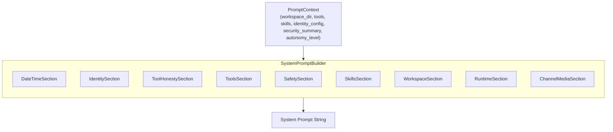
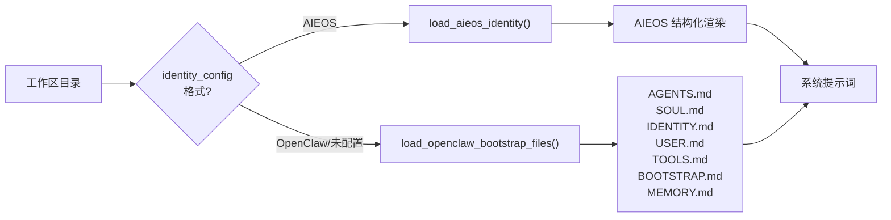
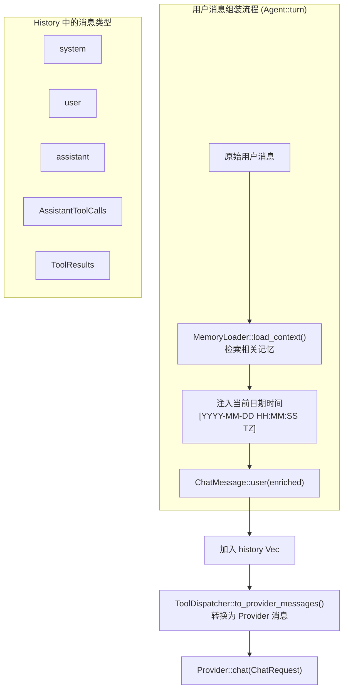
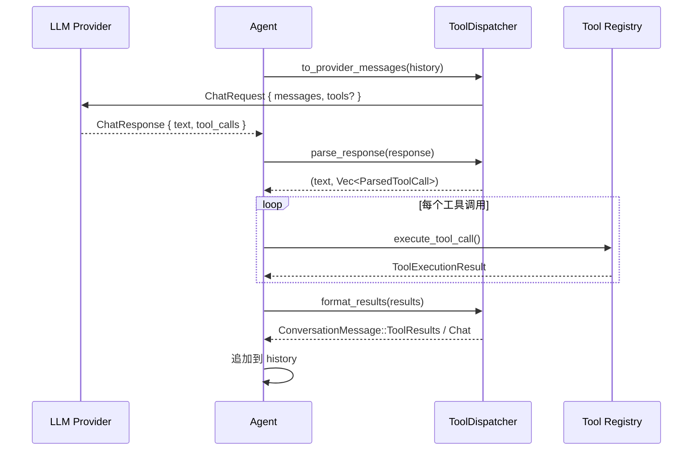
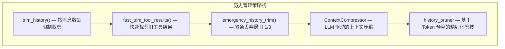
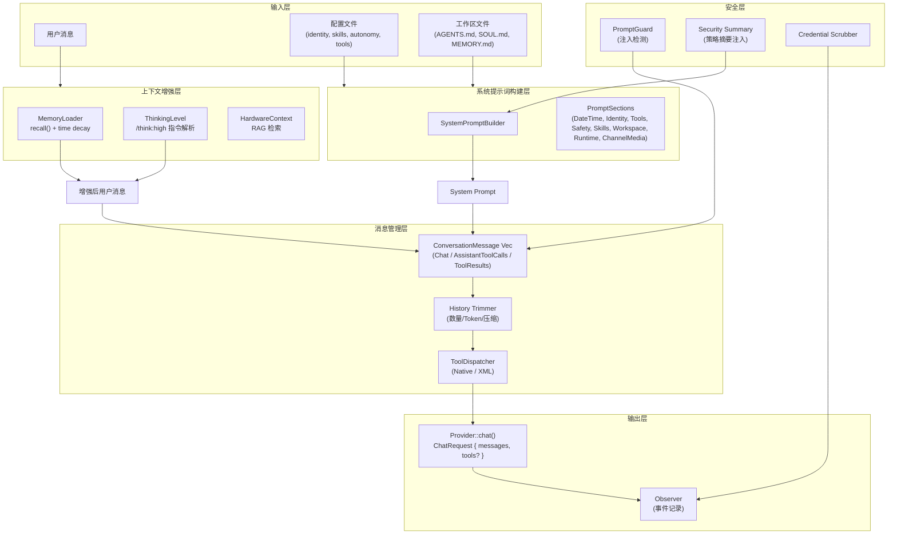

# ZeroClaw LLM 会话上下文构建说明

> 文档日期：2026-05-07
> 涉及模块：`crates/zeroclaw-runtime/src/agent/`、`crates/zeroclaw-api/src/provider.rs`

---

## 1. 概述

ZeroClaw 的 LLM 会话上下文由**系统提示词（System Prompt）**和**用户消息序列（Message History）**两部分构成。系统提示词在会话初始化时一次性构建，用户消息则在每次 `turn` 时动态组装并注入记忆上下文、日期时间等元数据。整个流程涉及系统提示构建器、消息分发器、历史管理器、上下文压缩器、安全层和可观测层等多个子系统。

---

## 2. 系统提示词构建

### 2.1 架构设计

系统提示词采用**模块化 Section 构建器模式**，通过 `SystemPromptBuilder` 聚合多个 `PromptSection` 实现按需组装。



### 2.2 默认 Section 列表

| Section | 源码位置 | 说明 |
|---------|---------|------|
| `DateTimeSection` | `prompt.rs:259` | 注入当前日期时间（ISO 8601 格式），用于相对时间计算 |
| `IdentitySection` | `prompt.rs:91` | 加载工作区身份文件（AIEOS 或 OpenClaw 格式） |
| `ToolHonestySection` | `prompt.rs:125` | 强制要求 LLM 不伪造工具结果 |
| `ToolsSection` | `prompt.rs:141` | 枚举可用工具及其参数 Schema |
| `SafetySection` | `prompt.rs:169` | 安全策略与自主性级别指令 |
| `SkillsSection` | `prompt.rs:216` | 注入已加载 Skill 的指令与工具元数据 |
| `WorkspaceSection` | `prompt.rs:230` | 当前工作目录路径 |
| `RuntimeSection` | `prompt.rs:243` | 主机名、操作系统、模型名称 |
| `ChannelMediaSection` | `prompt.rs:283` | 渠道媒体标记说明（语音、图片、文档） |

### 2.3 身份文件加载（Identity）

系统提示词支持两种身份格式：

1. **AIEOS 格式**：通过 `identity_config` 加载结构化身份数据（JSON），优先级最高
2. **OpenClaw Bootstrap 格式**：从工作区根目录读取以下文件注入上下文：
   - `AGENTS.md` — 代理行为定义
   - `SOUL.md` — 人格定义
   - `TOOLS.md` — 工具使用指南
   - `IDENTITY.md` — 身份信息
   - `USER.md` — 用户偏好
   - `BOOTSTRAP.md` — 首次运行仪式（可选）
   - `MEMORY.md` — 长期记忆索引

每个文件默认截断上限为 **20,000 字符**，超出部分标记为 truncated。



### 2.4 安全策略注入

`SafetySection` 根据 `AutonomyLevel` 动态生成指令：

- **Full**：直接执行工具，无需额外审批
- **Supervised**：仅在运行时策略要求时请求审批
- **ReadOnly**：只读运行，写操作会被运行时拒绝

当 `security_summary` 存在时，会在 Safety Section 后追加 **Active Security Policy** 子节，包含允许命令、禁止路径等具体约束（避免 LLM 试错）。

---

## 3. 用户消息组装流程

### 3.1 核心数据结构

#### ChatMessage（Provider 层消息）

```rust
// crates/zeroclaw-api/src/provider.rs
pub struct ChatMessage {
    pub role: String,    // "system" | "user" | "assistant" | "tool"
    pub content: String,
}
```

#### ConversationMessage（Agent 内部消息）

```rust
// crates/zeroclaw-api/src/provider.rs
pub enum ConversationMessage {
    Chat(ChatMessage),
    AssistantToolCalls {
        text: Option<String>,
        tool_calls: Vec<ToolCall>,
        reasoning_content: Option<String>,
    },
    ToolResults(Vec<ToolResultMessage>),
}
```

### 3.2 Turn 消息组装流程



### 3.3 消息增强细节

每次 `turn` 时，用户消息会被以下方式增强：

1. **记忆上下文注入**：通过 `DefaultMemoryLoader` 从记忆后端召回与用户消息相关的条目，过滤掉低于 `min_relevance_score`（默认 0.4）的条目，并应用时间衰减算法
2. **日期时间标记**：当前本地时间作为标记注入，确保 LLM 能正确理解相对时间表达
3. **Thinking Level 控制**：解析 `/think:high` 等内联指令，动态调整 temperature 和 system prompt prefix

增强后的消息格式示例（`turn_streamed` / `loop_.rs` 路径）：

```text
[Memory context]
- user_preference: 偏好简洁回答
[/Memory context]

[2026-05-07 14:30:00 CST]
用户原始消息内容...
```

> **注意**：`Agent::turn()` 非流式路径的组装顺序略有不同，为 `[CURRENT DATE & TIME]` → `Memory context` → `用户消息`。

---

## 4. 工具调用消息流转

ZeroClaw 支持两种工具调用协议：**Native**（OpenAI/Anthropic 原生 function calling）和 **XML**（基于 `<tool_call>` 标签的文本协议）。

### 4.1 两种 Dispatcher 对比

| 特性 | NativeToolDispatcher | XmlToolDispatcher |
|------|---------------------|-------------------|
| 工具规格发送 | 通过 Provider API 的 `tools` 字段 | 不发送，依赖文本指令 |
| 响应解析 | 解析 `ChatResponse.tool_calls` | 正则解析 `<tool_call>` 标签 |
| 结果格式化 | `ToolResults` 枚举（结构化） | 用户消息包裹 XML |
| 适用场景 | 支持原生工具调用的 Provider | 不支持原生工具的 Provider |

### 4.2 工具调用消息生命周期



---

## 5. 历史管理与上下文压缩

### 5.1 多层历史裁剪策略

ZeroClaw 采用**多级递进式**历史管理策略，按优先级依次触发：



### 5.2 关键机制

- **孤儿消息清理**：`remove_orphaned_tool_messages()` 确保历史开头不会出现无对应 `assistant` 的 `tool` 消息，否则 Anthropic 等 Provider 会拒绝请求
- **工具调用组原子性**：`AssistantToolCalls` 和 `ToolResults` 作为原子组删除，避免半配对状态
- **ContextCompressor**：当估计 Token 数超过上下文窗口的 `threshold_ratio`（默认 50%）时，保护头尾消息，使用 summarizer LLM 压缩中间段，摘要持久化到记忆系统

### 5.3 Token 估算

采用近似算法：

```
tokens = sum(message.content.len() / 4 + 4) * 1.2
```

其中 `+4` 为每条消息的角色/分隔符开销，`1.2` 为安全余量系数。

---

## 6. 完整上下文组装架构图



---

## 7. 关键源码索引

| 功能 | 文件路径 |
|------|---------|
| 系统提示构建器 | `crates/zeroclaw-runtime/src/agent/prompt.rs` |
| 旧版系统提示函数 | `crates/zeroclaw-runtime/src/agent/system_prompt.rs` |
| Agent 核心（turn/turn_streamed） | `crates/zeroclaw-runtime/src/agent/agent.rs` |
| 工具调用主循环 | `crates/zeroclaw-runtime/src/agent/loop_.rs` |
| 消息分发器（Native/XML） | `crates/zeroclaw-runtime/src/agent/dispatcher.rs` |
| 历史管理 | `crates/zeroclaw-runtime/src/agent/history.rs` |
| 上下文压缩 | `crates/zeroclaw-runtime/src/agent/context_compressor.rs` |
| 记忆加载器 | `crates/zeroclaw-runtime/src/agent/memory_loader.rs` |
| 提示注入防御 | `crates/zeroclaw-runtime/src/security/prompt_guard.rs` |
| 人格/身份加载 | `crates/zeroclaw-runtime/src/agent/personality.rs` |
| 思考级别控制 | `crates/zeroclaw-runtime/src/agent/thinking.rs` |
| Provider 消息定义 | `crates/zeroclaw-api/src/provider.rs` |

---

## 8. 总结

ZeroClaw 的 LLM 会话上下文构建遵循**分层组装、渐进压缩、安全内嵌**的设计原则：

1. **系统提示词**通过模块化 Builder 模式组装，支持身份文件动态注入和安全策略自适应
2. **用户消息**在每次交互时经记忆召回、日期时间注入、Thinking Level 调整后进入历史
3. **历史管理**采用多级防御策略：数量裁剪 → 工具结果截断 → 紧急删除 → LLM 压缩 → Token 预算剪枝
