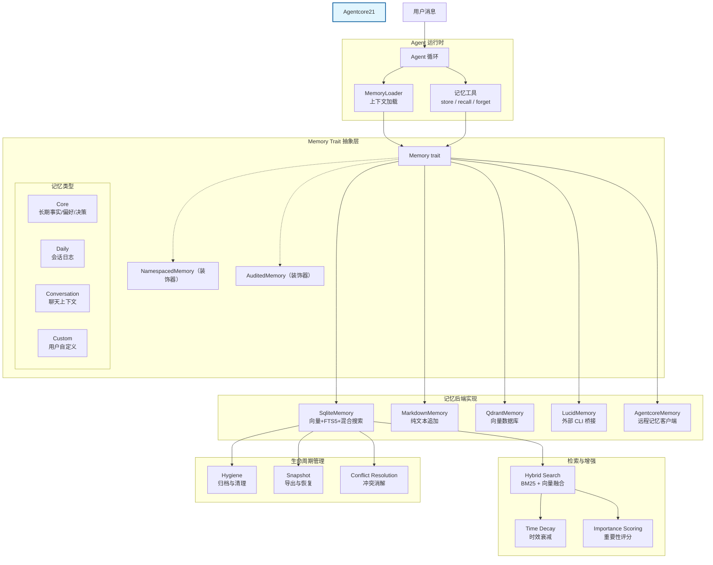
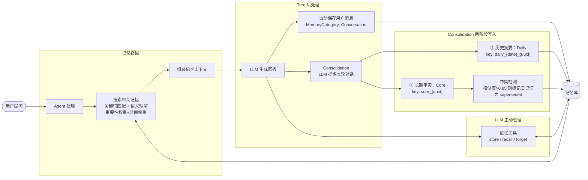
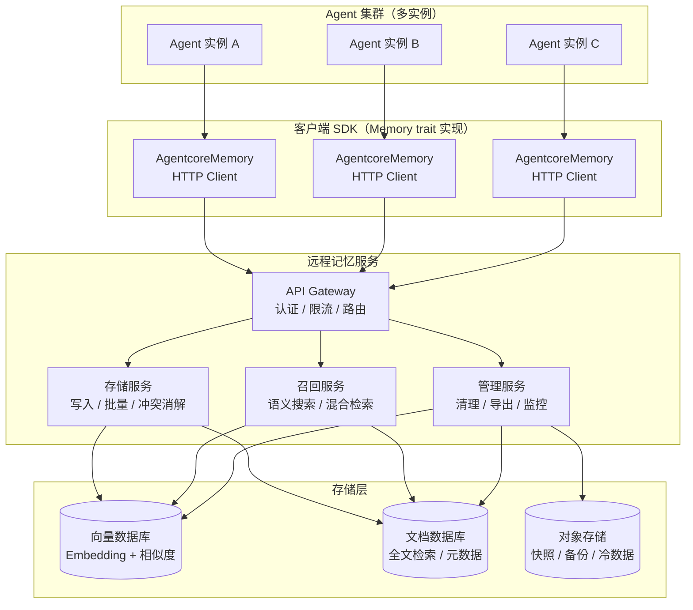
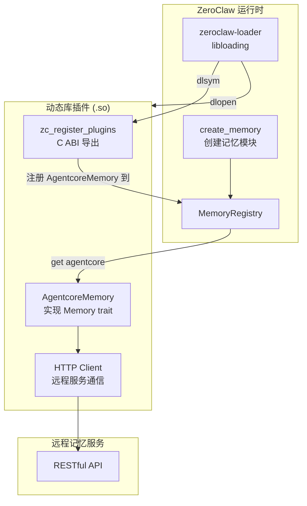
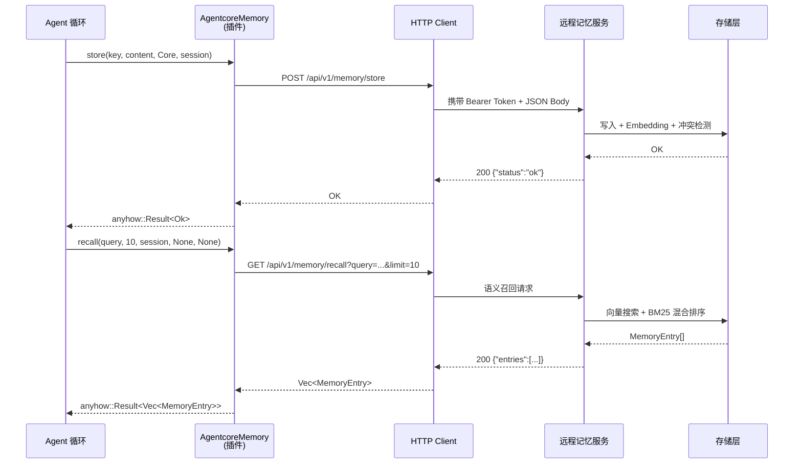

# ZeroClaw 记忆模块设计文档

> 本文档描述 ZeroClaw 智能体运行时中记忆子系统的架构、核心组件、数据流与扩展机制。

> **文档状态**
> - 第 1–2 章：描述当前已落地的记忆子系统架构（`Memory` trait、`SqliteMemory` 等后端、`consolidation`/`hygiene`/`snapshot`/`conflict` 生命周期模块）。
> - 第 3–4 章：`AgentcoreMemory` 远程记忆客户端及 RESTful 服务端接口的**设计草案**，尚未实现。

---

## 1. 设计目标

- **持久化与可检索**：支持长期事实、会话日志、对话上下文的多层级存储与高效召回。
- **语义搜索**：结合全文检索（FTS5/BM25）与向量相似度（Embedding / Cosine）实现混合搜索。
- **模块化与可替换**：通过 `Memory` trait 统一接口，支持 SQLite、Markdown、Qdrant、Lucid 等多种后端。
- **生命周期管理**：自动归档、过期清理、冲突消解、快照备份与冷启动自恢复。
- **安全与审计**：支持命名空间隔离、策略配额、操作审计日志。

---

## 2. 架构概览

### 2.1 架构视图

下图从架构角度展示当前记忆子系统的核心组件及其交互关系。记忆按类别（Core、Daily、Conversation、Custom）组织，Agent 通过统一的 `Memory` trait 与各类后端交互，实现存储与召回。



**架构要点说明：**

- **Agent 运行时**通过 `MemoryLoader` 在每次用户交互前加载相关记忆上下文，并借助**记忆工具**让 LLM 主动管理记忆。
- **Memory Trait 抽象层**定义统一接口；各记忆后端（`SqliteMemory`、`MarkdownMemory`、`QdrantMemory`、`LucidMemory`、`AgentcoreMemory`）均直接实现该 trait。装饰器（`NamespacedMemory`、`AuditedMemory`）以透明方式增强已有后端，提供隔离与审计能力。
- **记忆类型**（Core / Daily / Conversation / Custom）属于抽象层概念，决定数据的保留策略、衰减策略与重要性基线，由后端在存储与召回时依据分类执行差异化处理。
- **记忆后端**负责实际持久化；当前以 `SqliteMemory` 为核心，支持混合搜索（FTS5 + 向量），其他后端可按场景替换。`AgentcoreMemory`（蓝色高亮）为待实现的远程记忆客户端，同样直接实现 `Memory` trait，对 Agent 侧无侵入。
- **检索流水线**在召回阶段依次经过混合搜索、时效衰减与重要性评分，最终形成注入 Agent 上下文的记忆片段。
- **生命周期管理**负责定期清理过期数据、导出核心记忆快照，并在存储前消解语义冲突。

**记忆类型说明**

记忆按类别分层组织，不同类别对应不同的保留策略、衰减策略与重要性基线，由后端在存储与召回时差异化处理。

| 类型 | 含义 | 重要性基线 | 时效衰减 | 冲突消解 | 典型用途 |
|------|------|------------|----------|----------|----------|
| **Core** | 长期事实、用户偏好、关键决策 | `0.7`（最高） | ❌ 永不衰减 | ✅ 存储前进行语义冲突检测 | 注入 Agent system prompt 的长期记忆 |
| **Daily** | 每日会话日志、原始历史流水 | `0.3`（中） | ✅ 随时间衰减 | ❌ 不检测 | 对话原始记录，供 consolidation 提炼为 Core |
| **Conversation** | 当前/近期对话上下文 | `0.2`（最低） | ✅ 随时间衰减 | ❌ 不检测 | 实时保存用户与助手的消息，最易清理 |
| **Custom** | 用户或扩展定义的任意分类 | `0.4`（中高） | ✅ 随时间衰减 | ❌ 不检测 | 渠道/模块专用数据，如 Discord 历史、频道缓存 |

**详细说明：**

- **Core**：最珍贵的记忆层。存储用户长期偏好、关键事实和重要决策。在 `MarkdownMemory` 后端中存放于独立的 `core.md`，在 `decay` 模块中被标记为 evergreen（永不衰减），且在 `conflict` 模块中仅对 Core 执行语义相似度检测，防止重复或矛盾的事实并存。
- **Daily**：作为 Core 的“原材料”。每次 Agent 对话结束后，原始历史先以 Daily 保存，再经 LLM 提炼为 Core。当用户触发上下文重置（`/reset`）或压缩时，Daily 与 Conversation 会被一起清理。
- **Conversation**：临时性最强的记忆层。用户输入实时存入此分类，通常附带 `session_id` 命名空间以实现会话隔离。当消息长度 ≥ 20 字符且开启 `auto_save` 时自动保存。
- **Custom**：扩展点。Gateway API、CLI 和记忆工具均支持传入任意字符串作为类别，映射为 `Custom(String)`。例如 Discord 渠道使用 `"discord"` 和 `"channel_cache"` 两个自定义类别存放历史和频道元数据。

**待改进项：**

代码中仅自动保存 `user_msg` 到 `MemoryCategory::Conversation`，助手回复（`assistant_resp`）被明确排除，理由是：防止模型生成的幻觉/推断被重新注入上下文后自我放大。

然而，这会导致：
- Agent 只记得用户说过什么，不记得自己回应过什么。
- 助手回复中不全是幻觉，还包含大量对后续交互至关重要的信息，如工具调用结果、对用户的承诺、用户的反馈锚点等。
- 排除助手回复可防止模型幻觉被重新注入，但也导致助手侧的关键上下文丢失。

建议：保存所有助手回复，并对其进行”可信度”标注，在召回时附加可信度信息，由 LLM 自行判断哪些内容值得采信。

### 2.2 记忆处理流程

下图从业务功能视角展示一次典型交互中记忆子系统的数据流转：当用户发起提问时，系统如何自动召回相关知识以辅助 LLM 回答，以及对话内容如何被自动或主动持久化到记忆库。



**流程说明：**

1. **记忆召回**：用户每次提问时，Agent 自动从记忆库中召回相关知识。召回过程结合关键词匹配与语义理解，并综合考虑信息的时效性与重要性，最终筛选出最有价值的记忆注入 LLM 上下文，使回答更具连续性与个性化。
2. **自动保存（用户消息）**：对话过程中，用户输入和助手回复会被实时保存到 `MemoryCategory::Conversation`，作为短期对话上下文，支持按会话（session）隔离。
3. **Consolidation（Turn 后处理）**：LLM 生成回答后，系统会异步调用 `consolidate_turn` 对本轮对话进行两阶段提炼：
   - **Phase 1 — Daily**：将本轮对话（User + Assistant）交由 LLM 生成 1-2 句历史摘要，存入 `MemoryCategory::Daily`，作为原始对话日志。
   - **Phase 2 — Core**：提取本轮对话中诞生的新事实、偏好或决策，计算重要性评分后存入 `MemoryCategory::Core`。存储前执行语义冲突检测（相似度阈值 0.85），若发现与现有 Core 记忆矛盾，则将旧记忆标记为 `superseded`。
4. **主动管理**：在生成回答的过程中，LLM 也可以主动调用记忆管理工具（`memory_store` / `memory_recall` / `memory_forget`），将关键事实长期固化到记忆库，或清理过时、冗余的信息，实现自我演进的知识积累。

---

## 3. 远程记忆服务设计

远程记忆服务（Remote Memory Service）是独立于 Agent 实例的分布式记忆后端，通过 RESTful API 为多个 Agent 实例提供统一、持久、可扩展的记忆能力。Agent 侧通过实现 `Memory` trait 的客户端（`AgentcoreMemory`）接入，对上层业务代码无侵入。

### 3.1 架构定位



### 3.2 RESTful 接口设计

远程记忆服务对外暴露极简接口，仅保留 Agent 运行时最核心的四个操作。记忆管理（清理、遗忘、生命周期策略）由服务内部自治，不暴露给客户端。所有接口统一以 `/api/v1/memory` 为前缀，采用 JSON 作为数据交换格式，通过 Bearer Token 进行身份认证。

| 方法 | 路径 | 功能 | 请求体 / 参数 | 响应 |
|------|------|------|--------------|------|
| `POST` | `/api/v1/memory/store` | 单条存储 | `MemoryStoreRequest` | `{"status":"ok"}` |
| `GET` | `/api/v1/memory/recall` | 语义召回 | `query`, `limit`, `session_id`, `since`, `until` | `MemoryRecallResponse` |
| `GET` | `/api/v1/memory/get/{key}` | 精确 key 查询 | path: `key` | `MemoryEntry` / 404 |
| `DELETE` | `/api/v1/memory/{key}` | 按 key 删除 | path: `key` | `{"deleted":true}` / 404 |
| `GET` | `/api/v1/memory/list` | 列出现有记忆 | `category`, `session_id` | `MemoryListResponse` |
| `GET` | `/api/v1/memory/export` | 按条件导出快照 | `namespace`, `session_id`, `category`, `since`, `until` | `MemoryRecallResponse` |
| `GET` | `/api/v1/memory/health` | 健康检查 | — | `{"healthy":true}` |

**`MemoryStoreRequest`**
```json
{
  "key": "user_pref_language",
  "content": "User prefers Rust over Go",
  "category": "core",
  "session_id": null,
  "namespace": null,
  "importance": null
}
```

`namespace` 与 `importance` 为可选字段。当 `importance` 为 `null` 时，服务端按 `category` 基线计算（Core: 0.7，Daily: 0.3，Conversation: 0.2，Custom: 0.4）；当 `namespace` 为 `null` 时，使用默认命名空间。`consolidation` 写入 Core 记忆时，客户端通过 `store_with_metadata` 传入 `importance: 0.7`，但实际请求的仍是同一个端点，区别仅在可选字段是否填充。

**`MemoryRecallResponse`**
```json
{
  "entries": [
    {
      "id": "uuid",
      "key": "user_pref_language",
      "content": "User prefers Rust over Go",
      "category": "core",
      "timestamp": "2026-04-29T10:00:00Z",
      "session_id": null,
      "score": 0.92,
      "namespace": null,
      "importance": 0.7,
      "superseded_by": null
    }
  ]
}
```

**错误响应**

```json
{
  "error": {
    "code": "MEMORY_STORE_FAILED",
    "message": "Conflict detected: similar core memory exists"
  }
}
```

| 错误码 | HTTP 状态 | 说明 |
|--------|----------|------|
| `MEMORY_NOT_FOUND` | 404 | Key 不存在 |
| `MEMORY_STORE_FAILED` | 500 | 存储失败 |
| `MEMORY_RECALL_FAILED` | 500 | 召回失败（向量服务不可用） |
| `UNAUTHORIZED` | 401 | 认证失败 |

### 3.3 关键功能规划

- **极简接口**：仅暴露 `store` / `recall` / `get` / `health` 四个端点，记忆管理（清理、遗忘、生命周期）由服务内部自治
- **Embedding 内置化**：服务端直接托管 Embedding 模型，客户端只需传输纯文本
- **冲突消解下沉**：将 `consolidation` 和 `conflict::check_and_resolve_conflicts` 逻辑下沉到服务端，Agent 侧无感
- **多租户隔离**：按 `namespace` 和 `session_id` 隔离不同 Agent 实例的数据
- **数据生命周期**：按 category 配置 TTL、自动归档到冷存储，过期数据自动清理

---

## 4. 基于插件机制集成远程记忆服务

ZeroClaw 的插件系统支持 **动态库**（`.so` / `.dylib` / `.dll`）和 **WASM** 两种形式。
我们选择动态库插件实现 `AgentcoreMemory`（`Memory` trait 的客户端封装），将远程记忆服务集成到 ZeroClaw 。

### 4.1 插件机制概览



#### 核心组件说明

- **`zeroclaw-loader`** — 通过 `libloading` 加载 `.so`/`.dylib`/`.dll`，执行版本校验与符号解析
- **`RegistrySet`** — 统一管理 7 类组件的注册表，其中 `memory: MemoryRegistry` 用于注册自定义记忆后端
- **`MemoryRegistry`** — 保存插件与宿主之间的工厂注册回调

### 4.2 插件实现：AgentcoreMemory

`AgentcoreMemory` 是一个实现 `Memory` trait 的 Rust struct，内部封装 HTTP Client，将 trait 的每个方法映射到远程记忆服务的 RESTful 接口。

#### 核心结构

```rust
use zeroclaw_api::memory_traits::{Memory, MemoryCategory, MemoryEntry, ExportFilter};
use reqwest::Client;

pub struct AgentcoreMemory {
    client: Client,
    base_url: String,
    api_token: String,
    namespace: Option<String>,
}

impl AgentcoreMemory {
    pub fn new(base_url: &str, api_token: &str, namespace: Option<String>) -> Self {
        Self {
            client: Client::new(),
            base_url: base_url.trim_end_matches('/').to_string(),
            api_token: api_token.to_string(),
            namespace,
        }
    }

    fn auth_header(&self) -> String {
        format!("Bearer {}", self.api_token)
    }
}
```

**`namespace` 的隔离策略说明**

`Memory` trait 的 `store()` 签名本身不包含 `namespace` 参数。现有代码中的 `namespace` 隔离由 `NamespacedMemory` 装饰器统一实现，它包装任意 `Memory` 后端并在调用前附加 namespace。

`AgentcoreMemory` 的 `namespace` 字段**仅用于构造 HTTP 请求体**（远程服务端需要它来做多租户隔离），不在 trait 层面参与隔离。Agent 侧的标准用法为：

```rust
let remote = AgentcoreMemory::new("https://memory.example.com", token, Some("tenant-a".into()));
let namespaced = NamespacedMemory::new(remote, "tenant-a"); // trait 层面隔离
```

#### Trait 方法映射示例

**`store` → `POST /api/v1/memory/store`**

基础存储接口，不包含 `namespace` 与 `importance`（由 `store_with_metadata` 处理）。

```rust
#[async_trait]
impl Memory for AgentcoreMemory {
    fn name(&self) -> &str {
        "agentcore"
    }

    async fn store(
        &self,
        key: &str,
        content: &str,
        category: MemoryCategory,
        session_id: Option<&str>,
    ) -> anyhow::Result<()> {
        let req = serde_json::json!({
            "key": key,
            "content": content,
            "category": category.to_string(),
            "session_id": session_id,
        });

        let resp = self.client
            .post(format!("{}/api/v1/memory/store", self.base_url))
            .header("Authorization", self.auth_header())
            .json(&req)
            .send()
            .await?;

        if !resp.status().is_success() {
            let err: serde_json::Value = resp.json().await?;
            anyhow::bail!("Remote store failed: {}", err);
        }
        Ok(())
    }
```

**`store_with_metadata` → `POST /api/v1/memory/store`**

`consolidation` 写入 Core 记忆时需要指定 `importance`。`store_with_metadata` 与 `store` 调用同一个端点，区别仅在请求体中是否填充 `namespace` 与 `importance` 可选字段。

```rust
    async fn store_with_metadata(
        &self,
        key: &str,
        content: &str,
        category: MemoryCategory,
        session_id: Option<&str>,
        _namespace: Option<&str>,
        importance: Option<f64>,
    ) -> anyhow::Result<()> {
        let req = serde_json::json!({
            "key": key,
            "content": content,
            "category": category.to_string(),
            "session_id": session_id,
            "namespace": self.namespace,
            "importance": importance,
        });

        let resp = self.client
            .post(format!("{}/api/v1/memory/store", self.base_url))
            .header("Authorization", self.auth_header())
            .json(&req)
            .send()
            .await?;

        if !resp.status().is_success() {
            let err: serde_json::Value = resp.json().await?;
            anyhow::bail!("Remote store failed: {}", err);
        }
        Ok(())
    }
```

**`recall` → `GET /api/v1/memory/recall`**

```rust
    async fn recall(
        &self,
        query: &str,
        limit: usize,
        session_id: Option<&str>,
        since: Option<&str>,
        until: Option<&str>,
    ) -> anyhow::Result<Vec<MemoryEntry>> {
        let mut req = self.client
            .get(format!("{}/api/v1/memory/recall", self.base_url))
            .header("Authorization", self.auth_header())
            .query(&[("query", query), ("limit", &limit.to_string())]);

        if let Some(sid) = session_id {
            req = req.query(&[("session_id", sid)]);
        }
        if let Some(s) = since {
            req = req.query(&[("since", s)]);
        }
        if let Some(u) = until {
            req = req.query(&[("until", u)]);
        }

        let resp = req.send().await?;
        if !resp.status().is_success() {
            let err: serde_json::Value = resp.json().await?;
            anyhow::bail!("Remote recall failed: {}", err);
        }

        let body: serde_json::Value = resp.json().await?;
        let entries: Vec<MemoryEntry> = serde_json::from_value(body["entries"].clone())?;
        Ok(entries)
    }
```

**`forget` → `DELETE /api/v1/memory/{key}`**

```rust
    async fn forget(&self, key: &str) -> anyhow::Result<bool> {
        let resp = self.client
            .delete(format!("{}/api/v1/memory/{}", self.base_url, key))
            .header("Authorization", self.auth_header())
            .send()
            .await?;

        match resp.status().as_u16() {
            200 => Ok(true),
            404 => Ok(false),
            _ => {
                let err: serde_json::Value = resp.json().await?;
                anyhow::bail!("Remote forget failed: {}", err)
            }
        }
    }

    // get → GET /api/v1/memory/get/{key}
    // list → GET /api/v1/memory/list
    // export → GET /api/v1/memory/export
    // ... 其他方法同理
}
```

### 4.3 运行时的数据流

当 `backend = "agentcore"` 时，一次完整的记忆操作流程如下：



---

## 5. 实现清单

本文档第 3–4 章为设计草案，落地 `AgentcoreMemory` 及远程记忆服务时，需要修改以下代码位置：

### 5.1 客户端（`zeroclaw-memory` crate）

| # | 文件 | 修改内容 |
|---|------|---------|
| 1 | `crates/zeroclaw-memory/src/backend.rs:91` | 在 `classify_memory_backend` 中新增 `"agentcore" => MemoryBackendKind::Agentcore` 匹配分支 |
| 2 | `crates/zeroclaw-memory/src/lib.rs:220` | 在 `create_memory()` 工厂函数中增加 `Agentcore` 分支，解析配置并构造 `AgentcoreMemory` |
| 3 | `crates/zeroclaw-memory/src/agentcore.rs` | **新增文件**。实现 `AgentcoreMemory` struct 及 `Memory` trait |
| 4 | `crates/zeroclaw-memory/Cargo.toml` | 新增 `reqwest` 依赖（若尚未引入） |

### 5.2 服务端（远程记忆服务，建议独立 crate 或仓库）

| # | 组件 | 说明 |
|---|------|------|
| 1 | `POST /api/v1/memory/store` | 基础存储。请求体中 `namespace` 与 `importance` 为可选字段，服务端负责 Embedding、冲突检测，并按 `category` 计算默认 `importance` |
| 2 | `GET /api/v1/memory/recall` | 混合搜索（向量 + BM25），返回按 `score` 排序的条目 |
| 3 | `GET /api/v1/memory/get/{key}` | 精确 key 查询 |
| 4 | `DELETE /api/v1/memory/{key}` | 按 key 删除 |
| 5 | `GET /api/v1/memory/list` | 按 `category`/`session_id` 过滤列出 |
| 6 | `GET /api/v1/memory/export` | 按 `ExportFilter` 条件导出快照 |
| 7 | `GET /api/v1/memory/health` | 健康检查 |
| 8 | 内置 Embedding 服务 | 服务端直接托管 Embedding 模型，客户端只传纯文本 |
| 9 | 冲突消解下沉 | 将 `consolidation` 中的 `check_and_resolve_conflicts` 逻辑迁移到服务端 |
| 10 | 多租户隔离 | 按 `namespace` 隔离数据存储与召回范围 |
| 11 | TTL 与归档 | 按 `category` 配置自动归档、过期清理策略 |
